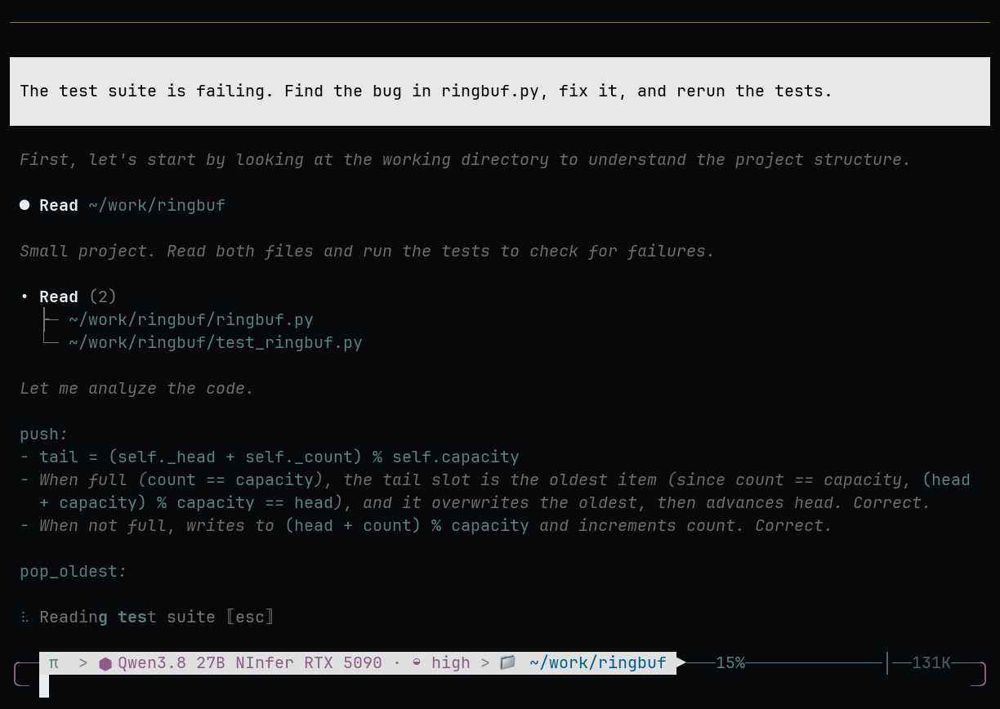

# OMP NInfer

**Resume long local Qwen coding sessions from saved model state after an inference-server
restart.** Qwen3.8 27B is the model, [Neroued’s NInfer](https://github.com/Neroued/ninfer)
is the inference engine, and [Oh My Pi](https://github.com/can1357/oh-my-pi) is the coding
agent. This project packages their integration, explicit continuation, and durable checkpoints
into exact, qualified releases. The v0.8.1 scope is one NVIDIA RTX 5090 or RTX 4090.

> **Before installing — v0.8.1 eligibility**
> - **RTX 5090:** documented Windows 11 + Docker Desktop/WSL2 runtime route.
> - **RTX 4090:** documented native Windows 11 route.
> - **RTX 3090 is deferred for v0.8.1.** Its separately linked
>   [historical v0.7.2 route](https://github.com/alphastorm/omp-ninfer/blob/v0.7.2/docs/QUICKSTART.md)
>   stays on OMP 18.0.9; it is not qualified with the new client.
> - Use the exact pinned client, runtime, model, and profile in the
>   [v0.8.1 manifest](releases/v0.8.1/manifest.json).
>   Other deployments are not supported by implication; check the guide’s memory, disk, and download prerequisites.

<div align="center">

**[Get started with v0.8.1 →](docs/QUICKSTART.md)** · **[Download v0.8.1](https://github.com/alphastorm/omp-ninfer/releases/tag/v0.8.1)**

[Lanes](docs/QUICKSTART.md#choose-your-lane) · [Facts](docs/FACTS.md) ·
[Compare](docs/DECISION_GUIDE.md) · [Benchmarks](docs/BENCHMARKS.md) ·
[Architecture](docs/ARCHITECTURE.md) · [Performance](docs/PERFORMANCE.md) ·
[Security](docs/SECURITY.md) · [Roadmap](ROADMAP.md) · [Changelog](CHANGELOG.md)

[![CI][ci-badge]][ci]
[![Release][release-badge]][releases]
[![Decode][decode-badge]][benchmarks]
[![Context][context-badge]][benchmarks]
[![License][license-badge]][license]

[ci]: https://github.com/alphastorm/omp-ninfer/actions/workflows/ci.yml
[ci-badge]: https://img.shields.io/github/actions/workflow/status/alphastorm/omp-ninfer/ci.yml?branch=main&label=CI&labelColor=0B0E11
[releases]: https://github.com/alphastorm/omp-ninfer/releases
[release-badge]: https://img.shields.io/github/v/release/alphastorm/omp-ninfer?filter=v*&label=release&color=8E7BE8&labelColor=0B0E11
[benchmarks]: docs/BENCHMARKS.md
[decode-badge]: https://img.shields.io/badge/decode-140%20tok%2Fs%20measured-8E7BE8?labelColor=0B0E11
[context-badge]: https://img.shields.io/badge/context-130K%20exact-1C232B?labelColor=0B0E11
[license]: LICENSE
[license-badge]: https://img.shields.io/github/license/alphastorm/omp-ninfer?color=1C232B&labelColor=0B0E11

<sub><strong>Private by design:</strong> loopback-only endpoints · bearer-authenticated ·
fail-closed instead of cloud fallback · every byte hash-pinned</sub>

<sub>Historical v0.3.0 RTX 5090 coding demo: bug fixed, tests rerun to green, then a
stateful follow-up. Not a restart demonstration or proof of the current release.
Idle gaps longer than 1.75 s are compressed; the unchanged MP4 is 15.3 s.</sub>



<sub><a href="docs/media/omp-ninfer-demo-v3.mp4">MP4</a> · <a href="docs/media/omp-ninfer-demo-v3-poster.png">poster</a> · <a href="docs/media/README.md#canonical-files">provenance and checksums</a></sub>

</div>

| What changes for you | Historical released evidence (not new v0.8.1 measurements) |
| --- | --- |
| Retained state outlives the turn — and the process | Historical v0.4.0, one RTX 5090: **109,589 retained tokens** served after restart; **24.8 s end-to-end including first-touch checkpoint restore**, plus a separately measured **56.6 s model reload** |
| Agent branches share the base, not re-prefill it | Four subagent branches from one 67.7K-token base: **148.7 s → 3.84 s** on v0.4.4, **0.40 s** to first token when the anchor is device-resident |
| Interactive output is fast | **136.03 tok/s** decode on the qualified RTX 5090 profile (41.20% MTP acceptance at temperature 0 on the technical-writing gate) |
| Long coding sessions fit | Exact retrieval at a **130,048-token** prompt; 131,072-token ceiling |
| The route does not escape to cloud | Loopback-only, bearer-authenticated, fail-closed; acceptance-tested |
| Checkpoints don't stall the session | Export runs off the engine lock on v0.4.4: warm follow-up during checkpoint traffic **15.26 s → 0.91 s**, explicit 5.19 GB save **31.6 s → 13.8 s** |

The historical v0.4.0 RTX 5090 receipt records **0.778 s server-side time to first token
after restoration**, not checkpoint restore or restart time. The **24.8 s** boundary includes
first-touch restoration of a **7.95 GB** checkpoint; the **56.6 s model reload** is separate.
A different request pair measured **47.920 s cold wall time vs 1.790 s warm follow-up wall time**
at a 109,594-token session. These single-machine samples are not a same-boundary comparison
of 0.778 s with 47.920 s, a restart speedup ratio, or a subsecond reboot.
[Restart receipt](docs/measurements/2026-08-30-rtx5090-durable-qualification.json) ·
[Warm/cold receipt](docs/measurements/2026-08-30-warm-vs-cold-v04.json) ·
[Method and other measurements](docs/BENCHMARKS.md).

**Use OMP NInfer when:** you use OMP, own a qualified card, want Qwen3.8, and care about private,
long-lived coding sessions.

**Use something else when:** you want a broad model catalog, an unsupported GPU, multi-user
serving, or generic OpenAI-compatible inference.

> [!IMPORTANT]
> **v0.8.1 is the current public release — faster decode.**
> The unmodified upstream **OMP 18.3.0** client, model, serving settings and memory floors are
> unchanged from v0.8.0. RTX 5090 decode is **10.3-11.0% faster** with identical outputs;
> RTX 4090 native C1 decode is **157.89 vs 153.54 tok/s** after keeping one-row split2 kernels.
> RTX 5090 ships `v0.6.10-qwen38-5090-beta.1`; RTX 4090 ships `v0.6.8-qwen38-4090-beta.1`.
> Every runtime gate was re-measured on the published bytes, matching v0.8.0's behavior.
> The upstream macOS arm64, Windows x64 and Linux x64 binaries passed live inference against the
> new RTX 5090 image; Linux ran in **Ubuntu under WSL2**, not a separately qualified non-WSL OS.
> [Documented-route acceptance](releases/v0.8.1/acceptance/documented-routes.json) passed all
> **24 steps**: RTX 5090 host 2, macOS client 10, Windows client 5, RTX 4090 native 7;
> both hosts were restored. RTX 3090 remains deferred.
> After upgrading, v0.8.0 checkpoints are incompatible; each session re-prefills once.
> Details: [release status](docs/RELEASES.md) · [compatibility matrix](docs/COMPATIBILITY.md).

## What this is — and isn't

A live [ninfer](https://github.com/Neroued/ninfer) or llama.cpp process with prefix caching
already avoids recomputing an append-only prefix — the engine this project ships does it too
(`prefix_reuse` is enabled in every shipped profile). If a warm in-process cache on a live server
is all you need, that works today without OMP NInfer.

What this project adds is continuation as an **explicit, transactional, durable** primitive
rather than an implicit longest-prefix match. OMP tracks the Responses lineage end to end —
`previous_response_id`, forks, rollback — and as of v0.4.0 the continuation (session state plus
its required KV) is checkpointed to disk and restored after process death. Historical receipts
cover the then-qualified three lanes:
[109,589 tokens restored across a docker restart on the
5090](docs/measurements/2026-08-30-rtx5090-durable-qualification.json), [102,075 tokens restored
on the 4090](releases/v0.2.0-beta.1/qualification/rtx4090.json), [310 MB checkpoint restore on
the 3090](docs/measurements/2026-08-30-rtx3090-parity.json). An in-memory-only cache is lost
with its process; this project restores explicitly checkpointed continuation state.

**Checkpoints already leave the machine.** The shipped sync tool exports verified generations,
copies them to another host or NAS, and imports them back to local storage for restore. Recovery
after loss of local state was exercised on the three historical 2026-09-05 profiles; host-to-host transport and NAS
replication have separate receipts. Restore requires the same runtime binary, model, profile,
and session credentials: copying a checkpoint to a 4090 does not make a 5090 session runnable
there. Network shares are replica storage, never the live checkpoint root.
[Scope, usage, and evidence](docs/FACTS.md#checkpoint-transport-and-nas-replication).

## Why this exists

Serious OMP coding sessions run long: 100K-token transcripts, thinking, tool calls, images. Routed
to a cloud provider, every one of those tokens is metered and every file leaves your machine.
Routed to a typical local OpenAI-compatible server, the API is stateless — each turn re-sends the
whole transcript, and while a live server's prefix cache usually avoids recomputing an append-only
prefix, that reuse is an implicit longest-prefix guess that dies with the process.

OMP NInfer ships the third option as a small set of qualified lanes — OMP, the
[NInfer](https://github.com/Neroued/ninfer) engine, and one pinned Qwen3.8 27B artifact on an
RTX 5090 or RTX 4090 in v0.8.1 — with three properties qualified together:

1. **Continuation is explicit and durable, not guessed.** OMP drives NInfer through stateful
   OpenAI Responses (`previous_response_id`): continuation is addressed by transactional lineage —
   forks and rollback qualified — instead of inferred by longest-prefix matching. Explicitly
   saved continuation can survive process restarts within the profile’s restore limits. OMP
   commits its transcript before advancing provider state, so losing retained state degrades to a
   replay, never a broken session.
2. **Private and fail-closed.** Both endpoints bind loopback only; the route is
   bearer-authenticated; the shipped OMP configuration disables model fallback. When your GPU is
   unreachable, the turn fails with an error — it is never silently answered by a cloud model.
   That behavior is part of the acceptance suite, not a promise.
3. **Exact and verifiable.** The model is pinned by SHA-256, the runtime image by OCI digest with
   an SPDX SBOM, the client by checksum, and one release manifest binds them all.
   `python3 scripts/verify_release.py --require-ready` proves your clone is the qualified release.

## Measured, not estimated

Historical v0.6.8 profiles and receipts in
[`qualification.json`](releases/v0.6.8/qualification.json):

| Gate | Result |
| --- | --- |
| RTX 5090 decode | **139.78 tok/s** server-side over 2,048 tokens at temperature 0 on the lifecycle-started v0.6.4 candidate (134.80 tok/s wall); MTP3, 41.20% acceptance, 2.24 tokens per round |
| RTX 5090 prefill | **2,178.80 tok/s** at 130,048 tokens, exact retrieval, cold process, on the v0.6.4 candidate (2,177.70 tok/s again on the published image through the documented tunnel) |
| RTX 5090 fanout | **4/4** sibling forks on the base anchor at 57,853 and 67,681 tokens (medians 1.41 s and 1.82 s), and **4/4 again after a verified restart** (resume 3.45 / 3.65 s, forks ~1.4 s) — a 5.2 GB session restores in 3.6-3.8 s and a flipped payload byte is refused |
| Warm vs cold follow-up | **1.790 s warm wall time vs 47.920 s cold wall time** at a 109,594-token session — historical v0.4.0, one RTX 5090, one sample per point; this request pair does not measure restart duration |
| RTX 3090 native | **90.66 tok/s** decode, 93.43% MTP3 acceptance, exact 130,048-token retrieval at the 131,072 ceiling, 310 MB durable restart, durable v0.2.5-beta.1 train with origin-authenticated checkpoints, 300.2 W observed peak |
| RTX 4090 native | exact 130,048-token retrieval in **91.5 s**; **153.4 tok/s** decode at 87.6% MTP3 acceptance and 2,114.1 tok/s prefill on the C1 gate (a trajectory-sensitive fixture, EXP-037); 15/15 protocol checks at the shipped pool and again at a third of it; a never-published 45-token session and an explicitly saved one both restored across a graceful managed restart; exact OMP Golden-equivalent (mainline runtime v0.6.2-beta.1, sm_89, the same source as the 5090's v0.6.4) |
| Serving contract | OpenAI, Anthropic, and Responses protocols; tools; authenticated identity |

The **v0.8.1 runtime release** makes decode faster without changing the client, model, serving
settings or memory floors. The MTP3 verify pass shares activation loads across weight rows in
small-extent Q4/Q5 projections, and the Q4 gate/up kernel avoids shared-memory bank conflicts
([EXP-055](docs/measurements/2026-09-25-decode-kernel-schedules.json),
[EXP-054](docs/measurements/2026-09-25-decode-roofline-attribution.json)). RTX 5090 decode is
**10.3-11.0% faster** from a seed context to 31K tokens with identical outputs; RTX 4090 keeps
one-row split2 kernels for its MLP down and mixer output projections and reaches **157.89 vs
153.54 tok/s** on C1. These are lane-specific comparisons, not universal GPU claims.

On the published RTX 5090 image, exact 130,048-token retrieval took **59.1 s**, and the
2,048-token decode gate ran **151.33 tok/s**. Durability, publication-barrier,
fanout, warm-arrival, restore and multisession probes matched v0.8.0; none of 24 fresh sessions
fell back to a full prefill, with median time to first token **0.094-0.101 s**. The RTX 4090
package passed all 15 native phases, including exact long-context retrieval in **91.0 s**.
Stock OMP 18.3.0 kept one session across restarts on both lanes. Checkpoints from v0.8.0 do not
restore on the new server build: OMP resends the conversation and each session re-prefills once;
old checkpoints age out under the quota. [Release notes](releases/v0.8.1/NINFER_RELEASE_NOTES.md) ·
[RTX 5090 receipt](releases/v0.8.1/qualification/rtx5090.json) ·
[RTX 4090 receipt](releases/v0.8.1/qualification/rtx4090.json).

The **historical v0.8.0 runtime release** gave stock clients durable sessions: an authenticated request's
`prompt_cache_key` becomes its session identity, and a returning session's checkpoint is restored
on its first request after a restart. On both published lanes, unmodified OMP 18.3.0 kept one
session across graceful restarts, including a new OMP process resuming after a restart
([EXP-053](docs/measurements/2026-09-25-stock-omp-durable-sessions.json)). On the published
RTX 5090 image, the first session of each of three agent types prefilled its 11,887-14,199-token
prefix in 3.8-4.4 s; none of the 24 later fresh sessions fell back to a full prefill, and median
time to first token was 0.095-0.102 s. The image passed 130,048-token exact retrieval, decode
at 139.23 tok/s, and the durability, publication-barrier, fanout, warm-arrival, restore and
multisession probes. The RTX 4090 package passed all 15 native phases, including its first
managed start after a fresh install, 130,048-token retrieval in 91.1 s and C1 decode at
153.5 tok/s. [Release notes](releases/v0.8.0/NINFER_RELEASE_NOTES.md) ·
[RTX 5090 receipt](releases/v0.8.0/qualification/rtx5090.json) ·
[RTX 4090 receipt](releases/v0.8.0/qualification/rtx4090.json).

The **historical v0.7.4 runtime release** moved both mainline lanes to reviewed source `1c17c3fa` so a
graceful stop keeps live sessions. On the published RTX 5090 image, a workload with two
126K-token sessions, a fanout and the agent protocol stopped with
`saved 1, nothing to save 3, refused 0` - the v0.7.3 runtime refused two and lost their state -
and all four stored sessions resumed from their checkpoints after a restart. Holding one reply
out of the response store while another session's admission had to evict it, the runtime saved
that turn first and resumed it exactly. Saving before eviction costs the admitting request about
6.5 s per 126K-token session. The RTX 4090 package passed 15 qualification phases; its workload
evicted no checkpoint-tagged session, so save-before-evict is exercised on the RTX 5090 only.

RTX 5090 `v0.6.8-qwen38-5090-beta.1` and RTX 4090 native `v0.6.6-qwen38-4090-beta.1`
were published and accepted for v0.7.4. OMP stayed on 18.2.3, the model was unchanged, and neither
public serving profile nor host-memory floor moved. [Release notes](releases/v0.7.4/NINFER_RELEASE_NOTES.md) ·
[EXP-050 eviction workload](docs/measurements/2026-09-24-durable-session-eviction.json) ·
[EXP-051 publication barrier](docs/measurements/2026-09-24-publication-barrier.json) ·
[Historical releases](docs/RELEASES.md#version-identities).

Durable session checkpoints use DirectStorage on the native RTX 4090 lane (and the historical
v0.7.2 RTX 3090 lane), each bound by its own receipt. The RTX 5090 container keeps live-process warm
continuation; as of v0.4.0 a process restart restores the session from its durable checkpoint
(109,589 tokens hot in the qualification), with OMP transcript replay as the fallback when no
checkpoint exists. Automatic checkpoints remain best effort: a crash or an expired graceful wait
can still leave unsaved work. The v0.8.1 control again recorded two root fallbacks among eight
continuations/forks, so universal warm reuse is not promised.

The shipped artifact holds its capability through quantization — 96.67% AIME 2025/2026 and 87.37%
GPQA-Diamond in the upstream single-sample evaluation campaign. Numbers, methodology, caveats, and
the community leaderboard: [Benchmarks](docs/BENCHMARKS.md). These are measurements of one recorded
machine and profile, not universal GPU claims.

## What you get

- **A real coding model, resident.** Qwen3.8 27B — a hybrid Gated DeltaNet + attention
  architecture — as one 18.2 GB hash-pinned artifact, resident on your GPU with a 131,072-token
  context ceiling.
- **The full OMP agent surface.** Tools, Vision, stateful follow-ups, session forks, and preserved
  thinking, qualified together in one profile rather than advertised separately.
- **Speculative decoding that pays for itself.** The primary MTP3 profile measured 152.2 tok/s;
  each native GPU variant retains its own profile and receipt rather than inheriting that number.
- **An operable runtime.** Digest-pinned container, authenticated status identity, observable
  restart policy, owned stop path, and a launcher that refuses identity mismatches.
- **A support boundary you can read.** One [compatibility authority](compatibility.json), explicit
  non-claims, and issue forms that never ask for your prompts or logs.

## Get started

For v0.8.1, choose the RTX 5090 Windows 11 + Docker Desktop/WSL2 container route or the
RTX 4090 native Windows 11 route. Each needs the checksummed upstream OMP 18.3.0 binary, the
exact runtime and model, and about 40 GiB free disk; the guide lists the lane-specific memory
floors. Install the documented provider fragment and export `PI_OPENAI_STATEFUL=1` in every shell
that launches OMP. Read the [v0.8.1 guide](docs/QUICKSTART.md) with its
[manifest](releases/v0.8.1/manifest.json), then follow its release verification and acceptance
steps. Do not mix client and runtime authorities from different releases.

Do not bypass the ready gate. The separately preserved
[v0.7.2 quickstart](https://github.com/alphastorm/omp-ninfer/blob/v0.7.2/docs/QUICKSTART.md) and
[manifest](https://github.com/alphastorm/omp-ninfer/blob/v0.7.2/releases/v0.7.2/manifest.json)
remain the historical three-GPU / OMP 18.0.9 route, including RTX 3090. They do not qualify
RTX 3090 with OMP 18.3.0.

## How it works


- **OMP owns the truth.** Transcript, tools, branches, and replay live in OMP. A turn advances
  provider state only after a complete valid stream and durable transcript publication.
- **NInfer owns inference and retained state.** The hardware-tuned C++/CUDA engine comes from
  [Neroued/ninfer](https://github.com/Neroued/ninfer) and its GPU ports; this project's runtime
  adds explicit Responses state and durable checkpoints, scoped by authenticated client and
  session identity. Retained state is an acceleration, never the source of truth.
- **The manifest owns identity.** Exact client, image, model, configuration, and qualification
  bytes; `ready` status requires the composed external acceptance from public URLs.

Deep dive: [Architecture](docs/ARCHITECTURE.md) · [Security model](docs/SECURITY.md) ·
[Release lifecycle](docs/RELEASES.md).

Engine throughput and avoiding repeated prefill are separate benefits. The
[benchmarks](docs/BENCHMARKS.md) measure specific profiles and workloads, not a matched
head-to-head speed ranking against vLLM or llama.cpp.

## How it compares

Source-verified against public documentation, 2026-08. These projects move quickly; check their
current docs. Fuller analysis including LM Studio, vLLM's Agentic API, LMCache, SGLang HiCache, and
why no second gateway sits between OMP and NInfer: [Related work](docs/RELATED_WORK.md).

| | OMP NInfer | [Ollama](https://ollama.com) | [LM Studio](https://lmstudio.ai) | [llama.cpp server](https://github.com/ggml-org/llama.cpp/tree/master/tools/server) | [vLLM](https://github.com/vllm-project/vllm) |
| --- | --- | --- | --- | --- | --- |
| What it is | A small closed set of qualified OMP + runtime + model + GPU combinations with receipts | General local runtime with a large model library | Desktop app plus headless daemon with a large model catalog | General GGUF serving with the broadest hardware reach | High-throughput general serving engine |
| Session state across OMP turns | Stateful Responses owned end to end: transcript commits first, GPU-resident baseline advances second; survives OMP exit/resume; forks qualified | Stateless per request; transcript re-sent; in-process prefix reuse avoids recomputing matching prefixes | Stateless per request; chat state lives in the client | Stateless per request; per-slot prefix cache reuses matching prefixes | Stateless core with automatic prefix caching; separate Agentic API gateway adds server-side state |
| Restart and off-machine checkpoints | Durable restore on eligible lanes; verified historical host/NAS replicas; same-runtime/profile/credentials restore only ([scope](docs/FACTS.md#checkpoint-transport-and-nas-replication)) | Different mechanism/contract; verify current support | Different mechanism/contract; verify current support | Different mechanism/contract; verify current support | Different architecture, including external KV systems |
| Speculative decoding on the shipped model | Profile-specific: MTP3 on both v0.8.1 lanes | Model/config dependent | Desktop app plus headless daemon with a large model catalog | Optional draft/ngram setups | Optional |
| Vision, tools, thinking | Qualified together in one profile | Varies by model | Varies by model; tools and structured output documented | Varies by model and build | Varies by model |
| Release discipline | Model SHA-256, image OCI digest, SBOM, client checksums, one ready manifest | Rolling releases, mutable tags | Rolling desktop releases | Rolling builds | Rolling releases |
| Fail-closed OMP route | Shipped and acceptance-tested | Depends on your client config | Depends on your client config | Depends on your client config | Depends on your client config |
| Breadth | One pinned artifact and two eligible GPU lanes in the v0.8.1 manifest | Thousands of models, broad hardware | Large catalog, desktop UX, llama.cpp/MLX backends | Any GGUF, broad hardware | Broad models, datacenter and consumer GPUs |

Where each shines: **Ollama** is the easiest way to run many models locally. **LM Studio** is the
most polished desktop experience for browsing and running them. **llama.cpp** has the broadest
hardware and quant ecosystem. **vLLM** is the throughput and multi-tenant serving reference.
**OMP NInfer** is for one specific job — OMP plus Qwen on your own RTX card, long stateful coding
sessions, privacy as a tested invariant rather than a configuration hope.

## The NInfer family

This product rides an ecosystem of single-GPU NInfer ports, each specializing the engine for one
architecture. Numbers below are published by each repository's maintainers on their own profiles
and quantization schemes; they are not cross-comparable and are not claims of this product.

| Repository | GPU | Published highlights | Relationship |
| --- | --- | --- | --- |
| [Neroued/ninfer](https://github.com/Neroued/ninfer) | RTX 5090 (`sm_120a`) | 1,313.8 aggregate tok/s at C=8 (35B-A3B); 15,544 tok/s prefill at 7,680 tokens | The original engine; everything below forks it |
| [alphastorm/ninfer](https://github.com/alphastorm/ninfer) | RTX 5090, RTX 4090, RTX 3090 | 152.2 tok/s on the primary 5090 profile; 90.17 C1 decode tok/s on the qualified native 3090 lane | This product's public runtime source and component releases |
| [UDPSendToFailed/ninfer-4090](https://github.com/UDPSendToFailed/ninfer-4090) | RTX 4090 (`sm_89`) | 229.9 tok/s MTP7 deep-context decode; 10.1 GB/s DirectStorage cold weight DMA; E8-lattice KV to 567K-token ceilings | Upstream of the qualified native 4090 beta branch |
| [Don-Chad/ninfer-3090](https://github.com/Don-Chad/ninfer-3090) | RTX 3090 (`sm_86`) | 165.3 tok/s decode at C=8; RotorQuant KV to 247,872-token contexts; ReplaySSM | Upstream of the historical native RTX 3090 lane |

The historical v0.7.2 manifest binds all three lanes to their exact package, receipt, and
profile. v0.8.1 eligibility is RTX 5090 and RTX 4090 only; RTX 3090 is deferred until its
host returns for new-client qualification. What comes next: [`ROADMAP.md`](ROADMAP.md).

## Benchmarks and leaderboard

[Benchmarks](docs/BENCHMARKS.md) holds the qualified results, the warm-vs-cold and per-lane
charts, the upstream campaign highlights, the model-quality table, and a community results table
seeded with the maintainer entries. Submit your environment's numbers with the
[performance result form](https://github.com/alphastorm/omp-ninfer/issues/new?template=benchmark-report.yml)
after the documented acceptance checks pass. Planned measurements we want next are listed there too.

## Help make it better

- **Ran a clean install?** Report
  [time-to-first-turn and every manual step](https://github.com/alphastorm/omp-ninfer/issues/new?template=clean-install-report.yml)
  — install friction is a bug.
- **Measured your card?** Submit numbers with the
  [performance result form](https://github.com/alphastorm/omp-ninfer/issues/new?template=benchmark-report.yml)
  after the acceptance checks pass; verified rows join the community leaderboard.
- **Work on CUDA kernels?** Pick a measured bottleneck from the
  [performance program](docs/PERFORMANCE.md) and submit before/after receipts with the same form.
- **Need a different model or profile?** File a
  [model/profile request](https://github.com/alphastorm/omp-ninfer/issues/new?template=model-profile-request.yml)
  so artifact identity and qualification scope stay explicit.

Docs, release tooling, and profile contracts belong here; engine work belongs in the runtime
repositories. The complete routing and evidence rules are in [`CONTRIBUTING.md`](CONTRIBUTING.md).

The v0.8.1 client is the unmodified upstream
[Oh My Pi v18.3.0 binary](https://github.com/can1357/oh-my-pi/releases/tag/v18.3.0), checked
against its SHA-256. This product no longer builds or publishes an OMP client. The
[alphastorm/oh-my-pi](https://github.com/alphastorm/oh-my-pi) fork and
[alphastorm/homebrew-omp](https://github.com/alphastorm/homebrew-omp) distributed the client
through v0.7.4; they are historical, not the v0.8.1 install path. Stock OMP has no
`omp appliance` commands: install and operate each lane through the [quickstart](docs/QUICKSTART.md).

## Roadmap

`v0.6.9` ships an independently implemented semantic port of upstream Qwen tool-parser
fixes `3b50962b` and `0c5d570c`: supported scalar unions, case-insensitive booleans, precise
numeric lexemes and mathematically integral values, duplicate parameters, and balanced embedded
markup. It preserves custom raw input, history, opaque IDs, and stream ownership; review
remediation prevents malformed-region rescans and recursive union traversal. Both mainline
components are published and lane-qualified; documented host/macOS and native public-install
acceptance passed against their published bytes.
`v0.6.8` puts both mainline lanes on one runtime source (`68a0722f`): the RTX 4090 native lane takes
the upstream engine work and the GDN capacity fix, and a fork continued while its sibling is alive no
longer answers HTTP 500 on any lane (ninfer#43, EXP-036).
`v0.6.7` moves the RTX 5090 runtime onto a selective backport of the upstream engine work - 18
commits taken with reasons, the rest deferred with reasons - requalified on every lane gate within
noise of the shipped runtime (EXP-035).
`v0.6.6` keeps the pinned client on its channel: the config every route installs turns the
client's startup update check off, so nobody is advised to `omp update` away from the hash-pinned
release bytes (#18).
`v0.6.5` closes the last uncovered route: the quickstart's primary macOS row runs end to end
from its own blocks with every outcome decided by the shell, including a session that survives
the server process - two blocks that were wrong for a Windows destination fixed at source
(EXP-033).
`v0.6.4` makes the documentation itself the accepted route: every Windows route runs end to end
from its own quickstart blocks on a stock host, and a clone yields the recorded bytes on every
platform - six defects a reader would have hit, and no acceptance script ever did, fixed at source
(EXP-032).
`v0.6.3` makes the route the documentation tells you to run durable: the published RTX 5090
container launcher now mounts a session store, so a session saved on it survives the server
process and continues exactly - which that route could not do at all before, while its server
reported the identity of a configuration qualified elsewhere (EXP-031).
`v0.6.2` puts all three lanes on one runtime tree: the RTX 5090 container lane moves off the
branch head it had served from since `v0.4.4` onto the mainline commit the native lanes build
from, requalified 7/7 on the owner appliance and re-verified against the anonymously pulled
image, with throughput and durability within run-to-run noise of `v0.5.1` (EXP-030).
`v0.6.1` makes a managed stop of the RTX 4090 lane save every live session: the manager signals
the server through a per-launch named kernel event instead of terminating it, and a session that
was never published survives a deliberate restart (EXP-028/EXP-029). `v0.6.0` brought the RTX 4090 lane onto the mainline runtime: the same context-cache
architecture the RTX 5090 container ships - sibling forks on a shared long anchor, warm arrival
across a restart, streamed SHA-verified restore - now serves on Ada from one source tree instead
of a divergent lane branch, requalified 15/15 on its own lifecycle tool (EXP-025 through
EXP-027). `v0.5.1` closed the second v0.5 promise on the RTX 5090: a checkpointed template
arrives warm across a restart, and a 5 GB restore takes about 4 s instead of 24 s
(EXP-022/EXP-023). `v0.5.0` made sessions leave the machine: origin-authenticated checkpoint
manifests hold on all three lanes and `scripts/checkpoint_sync.py` replicates verified
generations out and back (EXP-018). Next: the RTX 3090 lane follows onto mainline when its host
returns, and a same-profile machine-pair resume when a second card of one lane exists.
Signing/notarization, a shared public client
acceptance runner, and multi-owner clean-install evidence remain on the path to v1.0. No item
becomes a support claim before an exact package, receipt, and product manifest bind it.

Scope boundaries and explicit non-claims: [`ROADMAP.md`](ROADMAP.md).

## Release integrity

The release manifest is the authority for component identity. A release is ready only when:

```sh
python3 scripts/verify_release.py --require-ready
python3 -m unittest discover -s tests -v
```

Both pass on the tagged release. The ready manifest binds the upstream OMP release binaries,
compatibility authority, NInfer image and SBOM, model artifact, qualification summary, and an
owner-operated tester-equivalent external acceptance. For v0.8.1 this combines both lanes'
qualification on their published components, live upstream OMP 18.3.0 client receipts
against the RTX 5090 image, and documented-route acceptance for RTX 5090 and RTX 4090.
RTX 3090 is excluded. Published tags and
release notes must use those exact bytes. Lifecycle details: [Releases](docs/RELEASES.md).

## Feedback and support boundary

Use the [hardware report, installation failure, or benchmark forms](https://github.com/alphastorm/omp-ninfer/issues/new/choose).
Remove API keys, hostnames, usernames, private prompts, model outputs, and raw request logs before
attaching anything; the forms only ask for content-safe facts. The support boundary assumes a
single trusted owner on both machines; this release is not a multi-tenant service. Security reports go
through [private vulnerability reporting](SECURITY.md), never a public issue.

## Credits

Ordered by how much this product owes them:

1. **[Oh My Pi](https://github.com/can1357/oh-my-pi)** by
   [can1357](https://x.com/_can1357) — the coding agent this appliance exists to serve. OMP's
   provider architecture, transcript ownership, and session semantics are what make a stateful
   local backend worth building. Oh My Pi itself builds on
   [Pi](https://github.com/badlogic/pi-mono) by Mario Zechner. MIT.
2. **[NInfer](https://github.com/Neroued/ninfer)** by Neroued — the from-scratch C++/CUDA engine
   this whole family rides: the `.ninfer` artifact format, MTP speculative decoding, the hybrid
   GDN runtime, and the published performance and evaluation campaigns cited throughout these
   docs. Apache-2.0.
3. **The Qwen team** — the Qwen3.8 model family. The shipped artifact is the registered NInfer
   conversion published at
   [neroued/Qwen3.8-27B-NInfer](https://huggingface.co/neroued/Qwen3.8-27B-NInfer). Apache-2.0.
4. **[UDPSendToFailed/ninfer-4090](https://github.com/UDPSendToFailed/ninfer-4090)** — the RTX
   4090 port (E8-lattice KV quantization, DirectStorage weight DMA) the qualified 4090 lane builds
   on. Apache-2.0.
5. **[Don-Chad/ninfer-3090](https://github.com/Don-Chad/ninfer-3090)** — the RTX 3090 port
   (ReplaySSM, RotorQuant) underlying the historical native RTX 3090 lane. Apache-2.0.
6. Algorithm and library lineage — Gated DeltaNet
   ([arXiv:2412.06464](https://arxiv.org/abs/2412.06464)), Tri Dao's ReplaySSM note, Z-Lab's
   DFlash, Unsloth's NVFP4 weights, and vendored `utf8proc`, `nlohmann/json`, and `cpp-httplib` —
   credited in full in the runtime repositories.

How each upstream is tracked, with fork points and the current pull-in position:
[Upstream watch](docs/UPSTREAM.md).

OMP NInfer is a community project; it is not affiliated with or endorsed by Oh My Pi, Qwen, or
NVIDIA.

## Repositories

| Repository | Owns |
| --- | --- |
| [`alphastorm/omp-ninfer`](https://github.com/alphastorm/omp-ninfer) | Product front door: release manifests, profiles, quickstart, qualification composition, support boundary |
| [`alphastorm/ninfer`](https://github.com/alphastorm/ninfer) | Public tagged RTX 5090, RTX 4090, and RTX 3090 component source |
| [`can1357/oh-my-pi`](https://github.com/can1357/oh-my-pi) | Upstream OMP release binaries; v0.8.1 uses unmodified v18.3.0 |
| [`alphastorm/homebrew-omp`](https://github.com/alphastorm/homebrew-omp) | Historical client distribution through v0.7.4: archives plus stable `omp` and prerelease `omp-beta` casks |

Through v0.7.4, the OMP client source was the public fork at
[`alphastorm/oh-my-pi`](https://github.com/alphastorm/oh-my-pi). v0.8.1 uses upstream OMP directly;
this product no longer builds or publishes a client. The user-facing command remains `omp`;
"appliance" names the operating concept, and **OMP NInfer** names this integration and repository.

## License

MIT. NInfer and the Qwen artifact retain their own licenses and notices.
