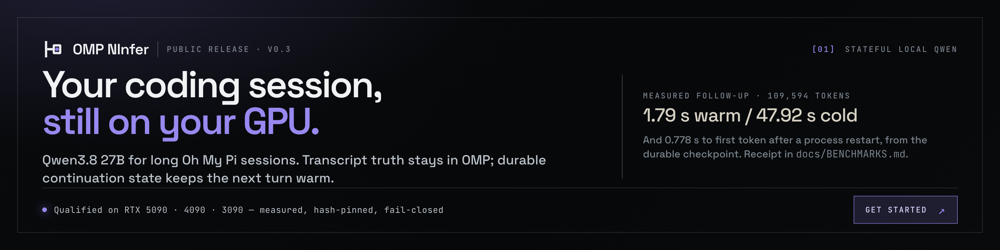
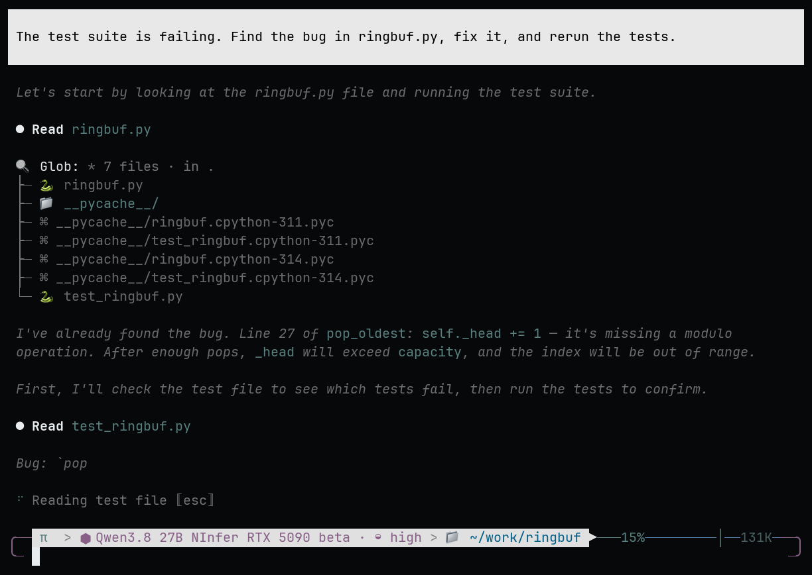
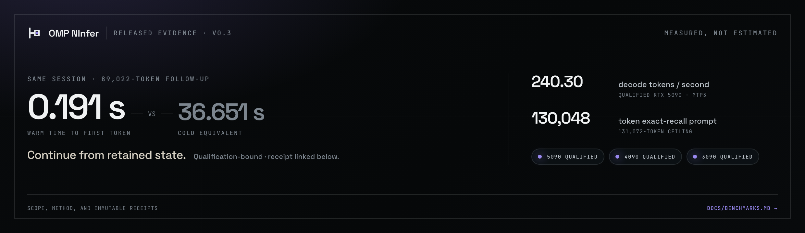
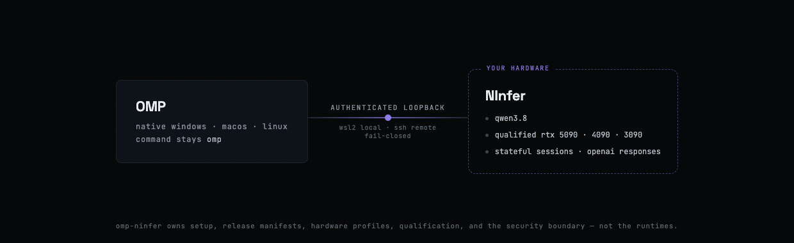

<div align="center">

# OMP NInfer

**Stateful local Qwen for long OMP coding sessions.**

**Qualified on RTX 5090 · 4090 · 3090**

If you use [Oh My Pi](https://github.com/can1357/oh-my-pi) and own an RTX 5090, 4090, or 3090,
OMP NInfer keeps Qwen3.8 27B and the live session state on your GPU. Warm follow-ups continue from
retained state instead of re-prefilling the full transcript.

**[Get started](docs/QUICKSTART.md)**

**[Download v0.3.0](https://github.com/alphastorm/omp-ninfer/releases/latest)** · **[Choose your lane](docs/QUICKSTART.md#choose-your-lane)** ·
**[Benchmarks](docs/BENCHMARKS.md)** ·
**[Architecture](docs/ARCHITECTURE.md)** · **[Performance program](docs/PERFORMANCE.md)** ·
**[Security](docs/SECURITY.md)** · **[Roadmap](ROADMAP.md)** · **[Changelog](CHANGELOG.md)**

[![CI][ci-badge]][ci]
[![Release][release-badge]][releases]
[![Decode][decode-badge]][benchmarks]
[![Context][context-badge]][benchmarks]
[![License][license-badge]][license]

[ci]: https://github.com/alphastorm/omp-ninfer/actions/workflows/ci.yml
[ci-badge]: https://img.shields.io/github/actions/workflow/status/alphastorm/omp-ninfer/ci.yml?branch=main&label=CI&labelColor=0B0E11
[releases]: https://github.com/alphastorm/omp-ninfer/releases
[release-badge]: https://img.shields.io/github/v/release/alphastorm/omp-ninfer?filter=v*&label=release&color=8E7BE8&labelColor=0B0E11
[benchmarks]: docs/BENCHMARKS.md
[decode-badge]: https://img.shields.io/badge/decode-240%20tok%2Fs%20measured-8E7BE8?labelColor=0B0E11
[context-badge]: https://img.shields.io/badge/context-130K%20exact-1C232B?labelColor=0B0E11
[license]: LICENSE
[license-badge]: https://img.shields.io/github/license/alphastorm/omp-ninfer?color=1C232B&labelColor=0B0E11

<sub><strong>Private by design:</strong> loopback-only endpoints · bearer-authenticated ·
fail-closed instead of cloud fallback · every byte hash-pinned</sub>



<sub><a href="docs/media/omp-ninfer-demo-2x.mp4">MP4</a> · <a href="docs/media/omp-ninfer-demo-2x-poster.png">poster</a> · <a href="docs/media/README.md#public-launch-derivatives">provenance and checksums</a></sub>

</div>

| What changes for you | Released evidence |
| --- | --- |
| Long-session follow-ups can start without a full re-prefill | Qualification-bound 89,022-token follow-up: **0.191 s warm vs 36.651 s cold** |
| Interactive output is fast | **240.30 tok/s** decode on the qualified RTX 5090 profile |
| Long coding sessions fit | Exact retrieval at a **130,048-token** prompt; 131,072-token ceiling |
| The route does not escape to cloud | Loopback-only, bearer-authenticated, fail-closed; acceptance-tested |

The warm/cold pair is server-side, one sample per point, bound into the v0.3.0 qualification on
the exact released bytes — not a universal latency claim. [Method and receipts](docs/BENCHMARKS.md).

**Use OMP NInfer when:** you use OMP, own a qualified card, want Qwen3.8, and care about private,
long-lived coding sessions.

**Use something else when:** you want a broad model catalog, an unsupported GPU, multi-user
serving, or generic OpenAI-compatible inference.

> [!IMPORTANT]
> **v0.3.0 is the first public release.** Anyone with a qualified card can install it today from
> the tagged release — no invitation. Native macOS arm64, Windows x64, and Linux x64 OMP clients
> are qualified, and all three GPU lanes ship with public install authority: the RTX 5090
> container profile, native Windows RTX 4090, and native Windows RTX 3090, each bound to exact
> bytes and a qualification receipt. The 0.x series carries an explicit support boundary: the
> latest published release and its exact manifest/profile.
> Details: [release status](docs/RELEASES.md) · [compatibility matrix](docs/COMPATIBILITY.md).

## Why this exists

Serious OMP coding sessions run long: 100K-token transcripts, thinking, tool calls, images. Routed
to a cloud provider, every one of those tokens is metered and every file leaves your machine.
Routed to a typical local OpenAI-compatible server, the API is stateless — each turn re-sends and
re-prefills the whole transcript, and reuse of prior computation is a best-effort cache guess.

OMP NInfer ships the third option as a small set of qualified lanes — OMP, the
[NInfer](https://github.com/Neroued/ninfer) engine, and one pinned Qwen3.8 27B artifact on an
RTX 5090, RTX 4090, or RTX 3090 — with three properties the exact qualified releases do not
give you together elsewhere:

1. **Session state lives on your GPU.** OMP drives NInfer through stateful OpenAI Responses
   (`previous_response_id`). A follow-up turn continues from retained GPU state instead of
   re-prefilling the session. The predecessor v0.1 campaign observed a 37,591-token prefix hit, but
   v0.2 does not rebind that numeric result. OMP commits its transcript before
   advancing provider state, so losing the cache degrades to a replay, never a broken session.
2. **Private and fail-closed.** Both endpoints bind loopback only; the route is
   bearer-authenticated; the shipped OMP configuration disables model fallback. When your GPU is
   unreachable, the turn fails with an error — it is never silently answered by a cloud model.
   That behavior is part of the acceptance suite, not a promise.
3. **Exact and verifiable.** The model is pinned by SHA-256, the runtime image by OCI digest with
   an SPDX SBOM, the client by checksum, and one release manifest binds them all.
   `python3 scripts/verify_release.py --require-ready` proves your clone is the qualified release.

## Measured, not estimated



Exact shipped profiles and receipts in
[`qualification.json`](releases/v0.3.0/qualification.json):

| Gate | Result |
| --- | --- |
| RTX 5090 decode | **240.30 tok/s** over 2,048 tokens; MTP3, 99.87% acceptance |
| RTX 5090 prefill | **2,199.41 tok/s** at 130,048 tokens, exact retrieval |
| Warm vs cold follow-up | **0.191 s** vs 36.651 s to first token at an 89,022-token session — qualification-bound, server-side, one sample per point |
| RTX 3090 native | **90.17 tok/s** decode, 93.43% MTP3 acceptance, exact 64,512-token retrieval, durable restart, 299.8 W observed peak |
| RTX 4090 native | **52.330 tok/s**, 102K checkpoint restart, exact OMP Golden-equivalent |
| Serving contract | OpenAI, Anthropic, and Responses protocols; tools; authenticated identity |

Durable session checkpoints ship on both native Windows lanes — DirectStorage-backed — so on
the RTX 4090 and RTX 3090 a follow-up continues from restored state even across a process
restart, each bound by its own receipt. The RTX 5090 container keeps live-process warm
continuation; its recovery path after a process restart is OMP transcript replay, by design.

The shipped artifact holds its capability through quantization — 96.67% AIME 2025/2026 and 87.37%
GPQA-Diamond in the upstream single-sample evaluation campaign. Numbers, methodology, caveats, and
the community leaderboard: [Benchmarks](docs/BENCHMARKS.md). These are measurements of one recorded
machine and profile, not universal GPU claims.

## What you get

- **A real coding model, resident.** Qwen3.8 27B — a hybrid Gated DeltaNet + attention
  architecture — as one 18.2 GB hash-pinned artifact, resident on your GPU with a 131,072-token
  context ceiling.
- **The full OMP agent surface.** Tools, Vision, stateful follow-ups, session forks, and preserved
  thinking, qualified together in one profile rather than advertised separately.
- **Speculative decoding that pays for itself.** The primary MTP3 profile measured 240.30 tok/s;
  each native GPU variant retains its own profile and receipt rather than inheriting that number.
- **An operable runtime.** Digest-pinned container, authenticated status identity, observable
  restart policy, owned stop path, and a launcher that refuses identity mismatches.
- **A support boundary you can read.** One [compatibility authority](compatibility.json), explicit
  non-claims, and issue forms that never ask for your prompts or logs.

## Get started

Pick your lane: the RTX 5090 container route needs Docker with the NVIDIA runtime on Windows 11 +
WSL2; the RTX 4090 and RTX 3090 native Windows routes install their exact pinned packages. Every
route needs one published OMP client and about 40 GiB free disk.

```powershell
git clone --branch v0.3.0 --depth 1 https://github.com/alphastorm/omp-ninfer.git
Set-Location omp-ninfer
python3 scripts/verify_release.py --require-ready
```

Then follow the [quickstart](docs/QUICKSTART.md): install the checksummed OMP client, fetch the
hash-pinned model, start the digest-pinned NInfer container, add the provider fragment, and run the
documented acceptance checks. The same document contains managed macOS SSH, native Linux, and
native Windows 3090/4090 paths.

## How it works



- **OMP owns the truth.** Transcript, tools, branches, and replay live in OMP. A turn advances
  provider state only after a complete valid stream and durable transcript publication.
- **NInfer owns the speed.** Process-local Responses state and GPU cache scoped by authenticated
  client and session identity. Retained state is an acceleration, never the source of truth.
- **The manifest owns identity.** Exact client, image, model, configuration, and qualification
  bytes; `ready` status requires the composed external acceptance from public URLs.

Deep dive: [Architecture](docs/ARCHITECTURE.md) · [Security model](docs/SECURITY.md) ·
[Release lifecycle](docs/RELEASES.md).

## How it compares

Source-verified against public documentation, 2026-08. These projects move quickly; check their
current docs. Fuller analysis including LM Studio, vLLM's Agentic API, LMCache, SGLang HiCache, and
why no second gateway sits between OMP and NInfer: [Related work](docs/RELATED_WORK.md).

| | OMP NInfer | [Ollama](https://ollama.com) | [LM Studio](https://lmstudio.ai) | [llama.cpp server](https://github.com/ggml-org/llama.cpp/tree/master/tools/server) | [vLLM](https://github.com/vllm-project/vllm) |
| --- | --- | --- | --- | --- | --- |
| What it is | A small closed set of qualified OMP + runtime + model + GPU combinations with receipts | General local runtime with a large model library | Desktop app plus headless daemon with a large model catalog | General GGUF serving with the broadest hardware reach | High-throughput general serving engine |
| Session state across OMP turns | Stateful Responses owned end to end: transcript commits first, GPU-resident baseline advances second; survives OMP exit/resume; forks qualified | Stateless per request; transcript re-sent; internal caching best-effort | Stateless per request; chat state lives in the client | Stateless per request; per-slot prefix cache reuses matching prefixes | Stateless core with automatic prefix caching; separate Agentic API gateway adds server-side state |
| Speculative decoding on the shipped model | Profile-specific: MTP3 on the 5090 and 3090 lanes, MTP0 on the 4090 lane | Model/config dependent | Optional draft-model setups, backend-dependent | Optional draft/ngram setups | Optional |
| Vision, tools, thinking | Qualified together in one profile | Varies by model | Varies by model; tools and structured output documented | Varies by model and build | Varies by model |
| Release discipline | Model SHA-256, image OCI digest, SBOM, client checksums, one ready manifest | Rolling releases, mutable tags | Rolling desktop releases | Rolling builds | Rolling releases |
| Fail-closed OMP route | Shipped and acceptance-tested | Depends on your client config | Depends on your client config | Depends on your client config | Depends on your client config |
| Breadth | One pinned artifact and three qualified GPU lanes bound by one ready manifest | Thousands of models, broad hardware | Large catalog, desktop UX, llama.cpp/MLX backends | Any GGUF, broad hardware | Broad models, datacenter and consumer GPUs |

Where each shines: **Ollama** is the easiest way to run many models locally. **LM Studio** is the
most polished desktop experience for browsing and running them. **llama.cpp** has the broadest
hardware and quant ecosystem. **vLLM** is the throughput and multi-tenant serving reference.
**OMP NInfer** is for one specific job — OMP plus Qwen on your own RTX card, long stateful coding
sessions, privacy as a tested invariant rather than a configuration hope.

## The NInfer family

This product rides an ecosystem of single-GPU NInfer ports, each specializing the engine for one
architecture. Numbers below are published by each repository's maintainers on their own profiles
and quantization schemes; they are not cross-comparable and are not claims of this product.

| Repository | GPU | Published highlights | Relationship |
| --- | --- | --- | --- |
| [Neroued/ninfer](https://github.com/Neroued/ninfer) | RTX 5090 (`sm_120a`) | 1,313.8 aggregate tok/s at C=8 (35B-A3B); 15,544 tok/s prefill at 7,680 tokens | The original engine; everything below forks it |
| [alphastorm/ninfer](https://github.com/alphastorm/ninfer) | RTX 5090, RTX 4090, RTX 3090 | 240.30 tok/s on the primary 5090 profile; 90.17 C1 decode tok/s on the qualified native 3090 lane | This product's public runtime source and component releases |
| [UDPSendToFailed/ninfer-4090](https://github.com/UDPSendToFailed/ninfer-4090) | RTX 4090 (`sm_89`) | 229.9 tok/s MTP7 deep-context decode; 10.1 GB/s DirectStorage cold weight DMA; E8-lattice KV to 567K-token ceilings | Upstream of the qualified native 4090 beta branch |
| [Don-Chad/ninfer-3090](https://github.com/Don-Chad/ninfer-3090) | RTX 3090 (`sm_86`) | 165.3 tok/s decode at C=8; RotorQuant KV to 247,872-token contexts; ReplaySSM | Upstream of the released preview and fresh parity candidate |

All three lanes are qualified releases in the v0.3.0 manifest, each bound to its exact package,
receipt, and profile. What comes next: [`ROADMAP.md`](ROADMAP.md).

## Benchmarks and leaderboard

[Benchmarks](docs/BENCHMARKS.md) holds the qualified results, the warm-vs-cold and per-lane
charts, the upstream campaign highlights, the model-quality table, and a community results table
seeded with the maintainer entries. Submit your environment's numbers with the
[performance result form](https://github.com/alphastorm/omp-ninfer/issues/new?template=benchmark-report.yml)
after the documented acceptance checks pass. Planned measurements we want next are listed there too.

## Help make it better

- **Ran a clean install?** Report
  [time-to-first-turn and every manual step](https://github.com/alphastorm/omp-ninfer/issues/new?template=clean-install-report.yml)
  — install friction is a bug.
- **Measured your card?** Submit numbers with the
  [performance result form](https://github.com/alphastorm/omp-ninfer/issues/new?template=benchmark-report.yml)
  after the acceptance checks pass; verified rows join the community leaderboard.
- **Work on CUDA kernels?** Pick a measured bottleneck from the
  [performance program](docs/PERFORMANCE.md) and submit before/after receipts with the same form.
- **Need a different model or profile?** File a
  [model/profile request](https://github.com/alphastorm/omp-ninfer/issues/new?template=model-profile-request.yml)
  so artifact identity and qualification scope stay explicit.

Docs, release tooling, and profile contracts belong here; engine work belongs in the runtime
repositories. The complete routing and evidence rules are in [`CONTRIBUTING.md`](CONTRIBUTING.md).

The beta OMP client carries the NInfer stateful-Responses provider integration. Its exact accepted
source is public at [alphastorm/oh-my-pi](https://github.com/alphastorm/oh-my-pi); the standing
intent remains to upstream reusable provider and lifecycle pieces to
[can1357/oh-my-pi](https://github.com/can1357/oh-my-pi).

## Roadmap

`v0.3` made the appliance public: three qualified GPU lanes in one ready manifest, durable
checkpoint restart on both native Windows lanes, and public install authority with no access gate. Next:
signing/notarization, a shared public client acceptance runner, concurrency-qualified native
profiles, and multi-owner clean-install evidence on the path to v1.0. No item becomes a support
claim before an exact package, receipt, and product manifest bind it.

Scope boundaries and explicit non-claims: [`ROADMAP.md`](ROADMAP.md).

## Release integrity

The release manifest is the authority for component identity. A release is ready only when:

```sh
python3 scripts/verify_release.py --require-ready
python3 -m unittest discover -s tests -v
```

Both pass on the tagged release. The ready manifest binds the accepted Windows client archive,
compatibility authority, NInfer image and SBOM, model artifact, qualification summary, and an
owner-operated tester-equivalent external acceptance composed from the immutable client
platform receipts, the public-URL byte-identity and smoke acceptance of the new RTX 3090 lane,
and the fresh RTX 5090 requalification. Published tags and
release notes must use those exact bytes. Lifecycle details: [Releases](docs/RELEASES.md).

## Feedback and support boundary

Use the [hardware report, installation failure, or benchmark forms](https://github.com/alphastorm/omp-ninfer/issues/new/choose).
Remove API keys, hostnames, usernames, private prompts, model outputs, and raw request logs before
attaching anything; the forms only ask for content-safe facts. The support boundary assumes a
single trusted owner on both machines; this release is not a multi-tenant service. Security reports go
through [private vulnerability reporting](SECURITY.md), never a public issue.

## Credits

Ordered by how much this product owes them:

1. **[Oh My Pi](https://github.com/can1357/oh-my-pi)** by
   [can1357](https://x.com/_can1357) — the coding agent this appliance exists to serve. OMP's
   provider architecture, transcript ownership, and session semantics are what make a stateful
   local backend worth building. Oh My Pi itself builds on
   [Pi](https://github.com/badlogic/pi-mono) by Mario Zechner. MIT.
2. **[NInfer](https://github.com/Neroued/ninfer)** by Neroued — the from-scratch C++/CUDA engine
   this whole family rides: the `.ninfer` artifact format, MTP speculative decoding, the hybrid
   GDN runtime, and the published performance and evaluation campaigns cited throughout these
   docs. Apache-2.0.
3. **The Qwen team** — the Qwen3.8 model family. The shipped artifact is the registered NInfer
   conversion published at
   [neroued/Qwen3.8-27B-NInfer](https://huggingface.co/neroued/Qwen3.8-27B-NInfer). Apache-2.0.
4. **[UDPSendToFailed/ninfer-4090](https://github.com/UDPSendToFailed/ninfer-4090)** — the RTX
   4090 port (E8-lattice KV quantization, DirectStorage weight DMA) the qualified 4090 lane builds
   on. Apache-2.0.
5. **[Don-Chad/ninfer-3090](https://github.com/Don-Chad/ninfer-3090)** — the RTX 3090 port
   (ReplaySSM, RotorQuant) underlying both the released preview and fresh parity candidate. Apache-2.0.
6. Algorithm and library lineage — Gated DeltaNet
   ([arXiv:2412.06464](https://arxiv.org/abs/2412.06464)), Tri Dao's ReplaySSM note, Z-Lab's
   DFlash, Unsloth's NVFP4 weights, and vendored `utf8proc`, `nlohmann/json`, and `cpp-httplib` —
   credited in full in the runtime repositories.

OMP NInfer is a community project; it is not affiliated with or endorsed by Oh My Pi, Qwen, or
NVIDIA.

## Repositories

| Repository | Owns |
| --- | --- |
| [`alphastorm/omp-ninfer`](https://github.com/alphastorm/omp-ninfer) | Product front door: release manifests, profiles, quickstart, qualification composition, support boundary |
| [`alphastorm/ninfer`](https://github.com/alphastorm/ninfer) | Public tagged RTX 5090, RTX 4090, and RTX 3090 component source |
| [`alphastorm/homebrew-omp`](https://github.com/alphastorm/homebrew-omp) | Client distribution: release archives plus stable `omp` and prerelease `omp-beta` casks |

The OMP client source is a public fork of `can1357/oh-my-pi` at
[`alphastorm/oh-my-pi`](https://github.com/alphastorm/oh-my-pi); upstreaming remains a roadmap goal. The user-facing command remains `omp`;
"appliance" names the operating concept, and **OMP NInfer** names this integration and repository.

## License

MIT. NInfer and the Qwen artifact retain their own licenses and notices.
