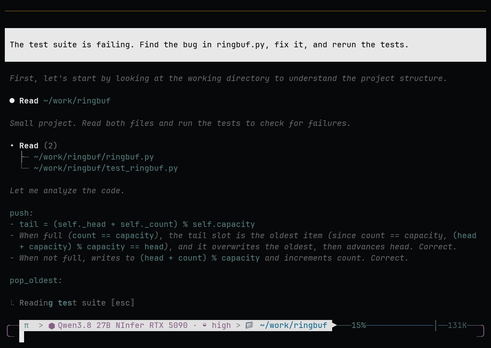
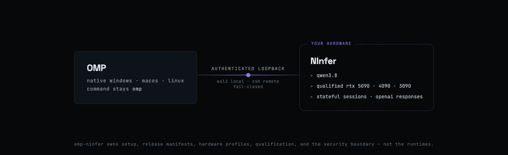

# OMP NInfer

**Resume long local Qwen coding sessions from saved model state after an inference-server
restart.** Qwen3.8 27B is the model, [Neroued’s NInfer](https://github.com/Neroued/ninfer)
is the inference engine, and [Oh My Pi](https://github.com/can1357/oh-my-pi) is the coding
agent. This project packages their integration, explicit continuation, and durable checkpoints
into exact, qualified releases. The v0.9.1 scope is one NVIDIA RTX 5090, RTX 4090 or RTX 3090.

> **Before installing — v0.9.1 eligibility**
> - **RTX 5090:** documented Windows 11 + Docker Desktop/WSL2 runtime route.
> - **RTX 4090:** documented native Windows 11 route.
> - **RTX 3090:** documented native Windows 11 route with upstream OMP 18.4.0. Its separate
>   [historical v0.7.2 route](https://github.com/alphastorm/omp-ninfer/blob/v0.7.2/docs/QUICKSTART.md)
>   stays on OMP 18.0.9; its sessions do not carry over to this lane.
> - Use the exact pinned client, runtime, model, and profile in the
>   [v0.9.1 manifest](releases/v0.9.1/manifest.json).
>   Other deployments are not supported by implication; check the guide’s memory, disk, and download prerequisites.

<div align="center">

**[Get started with v0.9.1 →](docs/QUICKSTART.md)** ·
**[Download v0.9.1](https://github.com/alphastorm/omp-ninfer/releases/tag/v0.9.1)**

[Lanes](docs/QUICKSTART.md#choose-your-lane) · [Facts](docs/FACTS.md) ·
[Compare](docs/DECISION_GUIDE.md) · [Benchmarks](docs/BENCHMARKS.md) ·
[Architecture](docs/ARCHITECTURE.md) · [Performance](docs/PERFORMANCE.md) ·
[Security](docs/SECURITY.md) · [Roadmap](ROADMAP.md) · [Changelog](CHANGELOG.md)

[![CI][ci-badge]][ci]
[![Release][release-badge]][releases]
[![Decode][decode-badge]][benchmarks]
[![Context][context-badge]][benchmarks]
[![License][license-badge]][license]

[ci]: https://github.com/alphastorm/omp-ninfer/actions/workflows/ci.yml
[ci-badge]: https://img.shields.io/github/actions/workflow/status/alphastorm/omp-ninfer/ci.yml?branch=main&label=CI&labelColor=0B0E11
[releases]: https://github.com/alphastorm/omp-ninfer/releases
[release-badge]: https://img.shields.io/github/v/release/alphastorm/omp-ninfer?filter=v*&label=release&color=8E7BE8&labelColor=0B0E11
[benchmarks]: docs/BENCHMARKS.md
[decode-badge]: https://img.shields.io/badge/decode-140%20tok%2Fs%20measured-8E7BE8?labelColor=0B0E11
[context-badge]: https://img.shields.io/badge/context-130K%20exact-1C232B?labelColor=0B0E11
[license]: LICENSE
[license-badge]: https://img.shields.io/github/license/alphastorm/omp-ninfer?color=1C232B&labelColor=0B0E11

<sub><strong>Private by design:</strong> loopback-only endpoints · bearer-authenticated ·
fail-closed instead of cloud fallback · every byte hash-pinned</sub>

<sub>Historical v0.3.0 RTX 5090 coding demo: bug fixed, tests rerun to green, then a
stateful follow-up. Not a restart demonstration or proof of the current release.
Idle gaps longer than 1.75 s are compressed; the unchanged MP4 is 15.3 s.</sub>



<sub><a href="docs/media/omp-ninfer-demo-v3.mp4">MP4</a> · <a href="docs/media/omp-ninfer-demo-v3-poster.png">poster</a> · <a href="docs/media/README.md#canonical-files">provenance and checksums</a></sub>

</div>

| What changes for you | Historical released evidence (not new v0.9.1 measurements) |
| --- | --- |
| Retained state outlives the turn — and the process | Historical v0.4.0, one RTX 5090: **109,589 retained tokens** served after restart; **24.8 s end-to-end including first-touch checkpoint restore**, plus a separately measured **56.6 s model reload** |
| Agent branches share the base, not re-prefill it | Four subagent branches from one 67.7K-token base: **148.7 s → 3.84 s** on v0.4.4, **0.40 s** to first token when the anchor is device-resident |
| Interactive output is fast | **136.03 tok/s** decode on the qualified RTX 5090 profile (41.20% MTP acceptance at temperature 0 on the technical-writing gate) |
| Long coding sessions fit | Exact retrieval at a **130,048-token** prompt; 131,072-token ceiling |
| The route does not escape to cloud | Loopback-only, bearer-authenticated, fail-closed; acceptance-tested |
| Checkpoints don't stall the session | Export runs off the engine lock on v0.4.4: warm follow-up during checkpoint traffic **15.26 s → 0.91 s**, explicit 5.19 GB save **31.6 s → 13.8 s** |

The historical v0.4.0 RTX 5090 receipt records **0.778 s server-side time to first token
after restoration**, not checkpoint restore or restart time. The **24.8 s** boundary includes
first-touch restoration of a **7.95 GB** checkpoint; the **56.6 s model reload** is separate.
A different request pair measured **47.920 s cold wall time vs 1.790 s warm follow-up wall time**
at a 109,594-token session. These single-machine samples are not a same-boundary comparison
of 0.778 s with 47.920 s, a restart speedup ratio, or a subsecond reboot.
[Restart receipt](docs/measurements/2026-08-30-rtx5090-durable-qualification.json) ·
[Warm/cold receipt](docs/measurements/2026-08-30-warm-vs-cold-v04.json) ·
[Method and other measurements](docs/BENCHMARKS.md).

**Use OMP NInfer when:** you use OMP, own a qualified card, want Qwen3.8, and care about private,
long-lived coding sessions.

**Use something else when:** you want a broad model catalog, an unsupported GPU, multi-user
serving, or generic OpenAI-compatible inference.

> [!IMPORTANT]
> **v0.9.1 is the current public release — RTX 3090 on the native Windows runtime.**
> RTX 3090 `v0.6.2-qwen38-3090-beta.1` (package `da1d62f2`, server `11b3f93c`) serves
> one request at a time under a **300 W cap**: **102.64 tok/s C1 decode**, **93.43% MTP
> acceptance**, and exact **130,048-token retrieval in 221.0 s**
> ([lane qualification](releases/v0.9.1/qualification/rtx3090.json)). RTX 5090 and RTX 4090
> components and profiles are unchanged from v0.9.0; existing owners change nothing. RTX 3090
> owners follow its native route and merge `ninfer-native-3090: 1` into OMP's provider limits.
> [Documented-route acceptance](releases/v0.9.1/acceptance/documented-routes.json) passed all
> **five routes, 31 steps** on candidate `c55185dd`: RTX 5090 container host 2, macOS client 10,
> Windows client 5, RTX 4090 native Windows 7 and RTX 3090 native Windows 7; all three hosts
> were restored. The unmodified upstream OMP 18.4.0 macOS arm64 (preview), Windows x64 and
> Linux x64 binaries each passed a typed tool turn, an exact continuation and a fail-closed
> request against image `4c816b0c`; Linux ran under **WSL2**, not a separately qualified Linux OS
> ([composed acceptance](releases/v0.9.1/acceptance/composed-external-installation.json)).
> Native lanes remain text/tools; vision stays on the RTX 5090. The fleet RTX 3090 scout role
> stays deferred: standalone qualification is not unattended fleet-role activation.
> Details: [release status](docs/RELEASES.md) · [compatibility matrix](docs/COMPATIBILITY.md).

## What this is — and isn't

A live [ninfer](https://github.com/Neroued/ninfer) or llama.cpp process with prefix caching
already avoids recomputing an append-only prefix — the engine this project ships does it too
(`prefix_reuse` is enabled in every shipped profile). If a warm in-process cache on a live server
is all you need, that works today without OMP NInfer.

What this project adds is continuation as an **explicit, transactional, durable** primitive
rather than an implicit longest-prefix match. OMP tracks the Responses lineage end to end —
`previous_response_id`, forks, rollback — and as of v0.4.0 the continuation (session state plus
its required KV) is checkpointed to disk and restored after process death. Historical receipts
cover the then-qualified three lanes:
[109,589 tokens restored across a docker restart on the
5090](docs/measurements/2026-08-30-rtx5090-durable-qualification.json), [102,075 tokens restored
on the 4090](releases/v0.2.0-beta.1/qualification/rtx4090.json), [310 MB checkpoint restore on
the 3090](docs/measurements/2026-08-30-rtx3090-parity.json). An in-memory-only cache is lost
with its process; this project restores explicitly checkpointed continuation state.

**Checkpoints already leave the machine.** The shipped sync tool exports verified generations,
copies them to another host or NAS, and imports them back to local storage for restore. Recovery
after loss of local state was exercised on the three historical 2026-09-05 profiles; host-to-host transport and NAS
replication have separate receipts. Restore requires the same runtime binary, model, profile,
and session credentials: copying a checkpoint to a 4090 does not make a 5090 session runnable
there. Network shares are replica storage, never the live checkpoint root.
[Scope, usage, and evidence](docs/FACTS.md#checkpoint-transport-and-nas-replication).

## Why this exists

Serious OMP coding sessions run long: 100K-token transcripts, thinking, tool calls, images. Routed
to a cloud provider, every one of those tokens is metered and every file leaves your machine.
Routed to a typical local OpenAI-compatible server, the API is stateless — each turn re-sends the
whole transcript, and while a live server's prefix cache usually avoids recomputing an append-only
prefix, that reuse is an implicit longest-prefix guess that dies with the process.

OMP NInfer ships the third option as a small set of qualified lanes — OMP, the
[NInfer](https://github.com/Neroued/ninfer) engine, and one pinned Qwen3.8 27B artifact on an
RTX 5090, RTX 4090 or RTX 3090 in v0.9.1 — with three properties qualified together:

1. **Continuation is explicit and durable, not guessed.** OMP drives NInfer through stateful
   OpenAI Responses (`previous_response_id`): continuation is addressed by transactional lineage —
   forks and rollback qualified — instead of inferred by longest-prefix matching. Explicitly
   saved continuation can survive process restarts within the profile’s restore limits. OMP
   commits its transcript before advancing provider state, so losing retained state degrades to a
   replay, never a broken session.
2. **Private and fail-closed.** Both endpoints bind loopback only; the route is
   bearer-authenticated; the shipped OMP configuration disables model fallback. When your GPU is
   unreachable, the turn fails with an error — it is never silently answered by a cloud model.
   That behavior is part of the acceptance suite, not a promise.
3. **Exact and verifiable.** The model is pinned by SHA-256, the runtime image by OCI digest with
   an SPDX SBOM, the client by checksum, and one release manifest binds them all.
   `python3 scripts/verify_release.py --require-ready` proves your clone is the qualified release.

## Measured, not estimated

Historical v0.6.8 profiles and receipts in
[`qualification.json`](releases/v0.6.8/qualification.json), with the current RTX 3090 lane
from [v0.9.1 qualification](releases/v0.9.1/qualification/rtx3090.json) labelled separately:

| Gate | Result |
| --- | --- |
| RTX 5090 decode | **139.78 tok/s** server-side over 2,048 tokens at temperature 0 on the lifecycle-started v0.6.4 candidate (134.80 tok/s wall); MTP3, 41.20% acceptance, 2.24 tokens per round |
| RTX 5090 prefill | **2,178.80 tok/s** at 130,048 tokens, exact retrieval, cold process, on the v0.6.4 candidate (2,177.70 tok/s again on the published image through the documented tunnel) |
| RTX 5090 fanout | **4/4** sibling forks on the base anchor at 57,853 and 67,681 tokens (medians 1.41 s and 1.82 s), and **4/4 again after a verified restart** (resume 3.45 / 3.65 s, forks ~1.4 s) — a 5.2 GB session restores in 3.6-3.8 s and a flipped payload byte is refused |
| Warm vs cold follow-up | **1.790 s warm wall time vs 47.920 s cold wall time** at a 109,594-token session — historical v0.4.0, one RTX 5090, one sample per point; this request pair does not measure restart duration |
| RTX 3090 native — current v0.9.1 | **102.64 tok/s C1 decode**, **93.43% MTP3 acceptance**, exact **130,048-token retrieval in 221.0 s** at the 131,072 ceiling; package `da1d62f2`, one request at a time, **300 W cap** |
| RTX 3090 native — historical durable v0.2.5-beta.1 | **90.66 tok/s** decode, 93.43% MTP3 acceptance, exact 130,048-token retrieval at the 131,072 ceiling, 310 MB durable restart with origin-authenticated checkpoints, 300.2 W observed peak; different lineage, client and profile, not a speed-up baseline for v0.9.1 |
| RTX 4090 native | exact 130,048-token retrieval in **91.5 s**; **153.4 tok/s** decode at 87.6% MTP3 acceptance and 2,114.1 tok/s prefill on the C1 gate (a trajectory-sensitive fixture, EXP-037); 15/15 protocol checks at the shipped pool and again at a third of it; a never-published 45-token session and an explicitly saved one both restored across a graceful managed restart; exact OMP Golden-equivalent (mainline runtime v0.6.2-beta.1, sm_89, the same source as the 5090's v0.6.4) |
| Serving contract | OpenAI, Anthropic, and Responses protocols; tools; authenticated identity |

The **v0.9.1 release — RTX 3090 on the native Windows runtime** adds the third eligible lane.
RTX 5090 and RTX 4090 components, profiles, model and memory floors are byte-identical to
v0.9.0. Existing owners change nothing; the unmodified upstream OMP 18.4.0 client,
`models.yml` and `PI_OPENAI_STATEFUL=1` are unchanged.

RTX 3090 ships `v0.6.2-qwen38-3090-beta.1` (package `da1d62f2`, server `11b3f93c`,
source `f08309da`, configuration `0f700667`). Its native Windows lifecycle has a managed
scheduled task, protected state, durable checkpoints, a graceful stop that saves live
sessions, and rollback to the previous release. It serves **one request at a time** with a
30 s pending timeout, 131,072 tokens of INT8 KV with MTP3, an 8192 MiB host-KV pool and
24 host-state slots; keep-warm is off. No host-memory floor is declared: qualification was
on one host. The controller holds the card at **300 W** while serving and restores the
owner's 370 W limit on stop.

The [lane receipt](releases/v0.9.1/qualification/rtx3090.json) passed all **15 lifecycle phases**:
exact **130,048-token retrieval in 221.0 s**, **102.64 tok/s C1 decode at 93.43% MTP
acceptance**, restart with a managed-stop flush of an unpublished session, rollback in both
directions against the lane's unpublished v0.6.0-beta.1 package, protected-state checks, the
agent protocol at the shipped pool and at 8 host-state slots, and an upstream OMP typed tool
turn. C1 is trajectory-sensitive; this runtime has no like-for-like RTX 3090 predecessor.
These figures are not a speed-up claim against the separate historical v0.7.2 route.

The first qualification window failed rollback because its controller read
`context_cache.host_kv_mib` under PowerShell strict mode from a predecessor configuration
that predates the field. Runtime fix `f08309da` passes `--host-kv-mib` only when the release
declares it. Every published RTX 4090 package already declares the field; that unchanged
lane was never exposed. Route fix `4c5ba8d` adds `ninfer-native-3090: 1` under
`providers.maxInFlightRequests` in
[`examples/manual-tunnel/fail-closed.yml`](examples/manual-tunnel/fail-closed.yml). Merge that
entry into `~/.omp/agent/config.yml`: an unlisted provider is unlimited in OMP, while this
server expires a queued request after 30 s.

All **five documented routes passed 31 steps** on candidate `c55185dd` with the published
components and unmodified OMP 18.4.0: RTX 5090 container host 2, macOS client 10, Windows
client 5, RTX 4090 native Windows 7 and RTX 3090 native Windows 7; all three hosts were
restored. Upstream macOS arm64 (preview), Windows x64 and Linux x64 binaries each passed a
typed tool turn, an exact continuation and a fail-closed request against RTX 5090 image
`4c816b0c`. Linux ran under **WSL2**, not a separately qualified Linux OS.
[Documented routes](releases/v0.9.1/acceptance/documented-routes.json) ·
[Composed acceptance](releases/v0.9.1/acceptance/composed-external-installation.json).

The RTX 5090 routes ran in **two production windows** from the maintainer's Apple silicon
workstation over the tailnet: downtime was at most **408.4 s (6.8 min)** and **386.5 s
(6.4 min)** ([restoration](docs/measurements/2026-10-01-v091-acceptance-restoration.json)).
The first passed every route, client probe and restoration check, but its summary refused
a scheduled-task snapshot: the unchanged supervisor was `Running` at baseline and `Ready`
at the end. Fix `0073553` compares task presence, definition and enabled state while keeping
hold markers byte-identical. The collected evidence passed the corrected summary, and a
fresh-workspace window on the same candidate passed. The RTX 3090 route ran with its console
signed out; managed start refuses while any process holds at least 1 GiB of GPU memory.

Both native lanes remain text/tools; vision is an RTX 5090 container capability. The fleet
RTX 3090 scout role stays deferred, not activated by standalone qualification. The historical
v0.7.2 RTX 3090 route keeps its OMP 18.0.9 fork client and separate sessions; they do not carry
over. [Release notes](releases/v0.9.1/NINFER_RELEASE_NOTES.md) ·
[Manifest](releases/v0.9.1/manifest.json) · [Qualification](releases/v0.9.1/qualification.json).

The **previous v0.9.0 release — two requests in flight on the RTX 5090** changed the RTX 5090 runtime,
profile and documented client limits.

The RTX 5090 serves **two requests at once** with `v0.6.14-qwen38-5090-beta.1`
(image `4c816b0c`, server `f62a570e`), deployment profile `qwen38-5090-v0.9.0` and
configuration `cf1de114`. The eight-token MTP3 verify round now uses the Q5 tensor-core route
instead of SIMT kernels. Two decoding requests reached **281.1-283.0 tok/s together**, against
166.7-167.1 one at a time (**1.68-1.70x**), up from v0.6.13's 190.0-191.1 with two requests.
The candidate answered the role corpus byte-identically to v0.6.13, two cases at a time and one
at a time (**89/89**); the published image matched both the candidate and v0.6.13 (**89/89**)
([EXP-077](docs/measurements/2026-09-29-rtx5090-two-requests-in-flight.json)).

The profile adds `--max-concurrency 2 --pending-timeout-ms 180000`. A request that cannot fit
beside the running one can wait **180 s**: the wait plus the longest root prefill, **130,048
tokens in 58.4 s** on the published image, stays inside OMP's **300 s** stream-idle watchdog.
The server ends a too-long wait and OMP resends. KV capacity auto-resolves to **160,256 tokens**;
VRAM after load is **30,242-30,244 MiB** of 32,607 MiB, against 28,144 MiB with one request.
Keep-warm, 16384 MiB host KV, the 24 GiB checkpoint quota, BF16 KV, MTP3, 131,072-token context
and the 28672 MiB runtime-host floor are unchanged.

The config every v0.9.0 documented route installed,
[`examples/manual-tunnel/fail-closed.yml`](examples/manual-tunnel/fail-closed.yml), sets the RTX 5090
providers to two requests in flight and keeps the RTX 4090 providers at one:

```yaml
providers:
  maxInFlightRequests:
    ninfer-beta: 2
    ninfer-native-4090: 1
    ninfer-main: 2
    ninfer-heavy: 1
```

**Upgrade the RTX 5090 server first**, then merge these limits into `~/.omp/agent/config.yml`,
including any other NInfer provider id you declare. A limit of 2 against the old one-at-a-time
server queues requests at its 30 s deadline, where they can expire. RTX 5090 checkpoints saved
by v0.8.7 re-prefill once after the build change. RTX 4090 stays on
`v0.6.10-qwen38-4090-beta.1` (package `a0ea4c81`, server `e0498fad`, configuration
`7a69481f`), one request at a time with a 30 s pending timeout; its checkpoints carry over.
The unmodified OMP 18.4.0 binary, `models.yml`, `PI_OPENAI_STATEFUL=1` and model are unchanged.

The [final-profile lane evidence](releases/v0.9.0/qualification/rtx5090.json) was collected on the
candidate image with the same server binary and arguments as the published image:

- Stock OMP durable sessions passed. EXP-072 long sessions at limit 2 had no root prefill over
  60K tokens; the third planting run stopped at the same harness precondition as v0.8.7.
- With 35 short sessions filling the 24 GiB store, a 60,026-token session reused **60,057 cached
  tokens after a crash in 2.99 s**.
- EXP-050's workload and resume restored **4/4 stored sessions** from checkpoints; stop saved 1
  and refused 0. EXP-051's held turn resumed exactly, but deferred save before eviction did not
  arise at two requests: the evicting session was admitted beside the held one.
- Fanout, warm-arrival, restore and multisession probes passed; **2 of 8** multisession
  continuations/forks lost reuse, as in v0.8.7. None of **24 fresh agent sessions** fell back to
  root, with median time to first token **0.092-0.100 s**.
- Restarting with two requests in flight ended both streams with `response.incomplete`; both
  continuations reused **62,404 cached tokens**, with first output in **5.07-5.53 s** and no
  refused shutdown saves.

On the published image, **130,048-token retrieval was exact in 58.4 s**, decode reached
**169.79 tok/s over 2,048 tokens**, the agent protocol passed across a restart, and VRAM after
load was **30,242 MiB**. Lane qualification and documented-route acceptance are separate evidence.

The costs remain visible: decode beside a 71,641-token prefill ran at **30.4-30.6 tok/s**, and a
request arriving during a staged prefill waited **26.6-26.7 s**. Two sessions above about **47K
tokens each take turns** (inferred from the admission rule; not measured with OMP). Two
alternating 62.4K-token sessions re-prefilled some continuations from root at both limits.
Stock OMP wall time followed generated tokens, with one run per limit per window: **no claim
that OMP work finishes sooner**. The robust gain is aggregate decode. Checkpoints remain best
effort; after the concurrency probe's evictions, stop refused 7 saves at two requests and 5
at one because the newest turns were no longer resident.

All four documented routes passed **24 steps** on candidate `0d2a7468`
(`0d2a746814aaddca328af7bf2582e48dbf6ce950`) with unmodified OMP 18.4.0 and the published
components: RTX 5090 container host 2, macOS client 10, Windows client 5 and RTX 4090 native
Windows 7; both hosts were restored. The upstream macOS arm64
(preview), Windows x64 and Linux x64 binaries each passed a typed tool turn, an exact
continuation and a fail-closed request against image `4c816b0c`. Linux ran under **WSL2**, not
a separately qualified Linux OS.
[Documented routes](releases/v0.9.0/acceptance/documented-routes.json) ·
[Composed acceptance](releases/v0.9.0/acceptance/composed-external-installation.json).

The RTX 5090 routes ran in **three production windows** from the maintainer's Apple silicon
workstation over the tailnet. Downtime was at most **101.5 s (1.7 min)** and **324.3 s
(5.4 min)** in the two failed windows and **499.3 s (8.3 min)** in the accepted window; total
downtime was at most **925.0 s (15.4 min)**
([restoration](docs/measurements/2026-09-30-v090-acceptance-restoration.json)).

Candidate `54f1402e` passed the RTX 4090 route, but its RTX 5090 window failed at the
container-host route's start step: the launcher still required the server to report one request
in flight, and the v0.9.0 profile serves two. The launcher now checks the concurrency, context
and KV type its profile declares. Production was back within 101.5 s, but the window's Windows
hold stayed up 10 min longer, because its WSL-side release went through an interop relay that
cannot start Windows processes; the host script now picks a live relay. Candidate `9eca7bae`
passed the RTX 4090 route and the container-host route, but in its RTX 5090 window the Linux
client sent no request in 210 s: OMP 18.4.0's print mode reads piped stdin to EOF before it
starts, and the window's drivers had forwarded a terminal that never closes. Every acceptance
client now reads an empty stdin. Candidate `0d2a7468` passed the RTX 4090 route and a third
RTX 5090 window.

RTX 3090 was deferred in v0.9.0. [Release notes](releases/v0.9.0/NINFER_RELEASE_NOTES.md) ·
[Manifest](releases/v0.9.0/manifest.json) · [Qualification](releases/v0.9.0/qualification.json).

The **historical v0.8.7 release — long sessions keep their cache** changed both runtimes and the
documented client config.

Long sessions no longer re-prefill from root at compaction handoffs, near-capacity turns, crashes
after a compaction, or when short sessions fill the checkpoint store. Both lanes move to runtimes
with the same fixes: RTX 5090 `v0.6.13-qwen38-5090-beta.1` (image `d71e34c3`, server `b8ae62ae`)
and RTX 4090 `v0.6.10-qwen38-4090-beta.1` (package `a0ea4c81`, server `e0498fad`). The config every
documented route installs, [`examples/manual-tunnel/fail-closed.yml`](examples/manual-tunnel/fail-closed.yml),
limits each NInfer provider to one request in flight and leaves compaction at OMP's default, so OMP
compacts in the background again and the turn that meets a running summary waits in OMP instead of
expiring at the server ([EXP-074](docs/measurements/2026-09-29-long-session-cache.json)):

- RTX 4090 compaction handoffs reused **78.0-79.9K cached tokens** and reached the first token in
  **0.58-0.70 s**; v0.6.9 prefilled 97.4-97.5K tokens from root in 63.8-66.3 s.
- Near-capacity turns whose planner search runs out of time keep their continuation. In three
  stock OMP sessions on the RTX 5090, the three fallback turns reused **78.0-80.5K cached tokens**
  (12.4-12.5 s to the first token) and **no turn prefilled more than 60K tokens from root**;
  v0.6.12 production's log holds four such turns of 93.7-105.1K tokens, each prefilled from root.
- After a hard kill following a compaction, the next RTX 4090 turn reused **32,167 cached tokens
  in 2.9 s**; v0.6.9 prefilled 32,173 tokens from root in 29.2 s.
- With 35 short sessions filling the RTX 5090's 24 GiB checkpoint store, a 60,026-token session
  kept its checkpoint and after a crash reused **60,057 cached tokens in 2.9 s** (3.1 s on the
  RTX 4090); v0.6.9 had reclaimed that checkpoint first and failed the turn with
  `previous_response_not_found`.
- With the provider limit, three RTX 4090 handoff compactions and a restart ran **55 requests with
  none expired**, and 22 turns took **365.4 s** where v0.8.6's inline compaction took 678.2 s for
  24. The limit must name the route's own provider id: OMP leaves an unlisted provider unlimited.

The kernels are unchanged. The RTX 5090 candidate and published image answered the 89-case role
corpus byte-identically to v0.6.12, and the published image prefilled **130,048 tokens exactly in
58.3 s** and decoded **170.36 tok/s**. The RTX 4090 package passed all 15 canonical phases with
OMP 18.4.0: 130,048-token retrieval in 91.2 s and C1 decode at **157.91 tok/s** with 87.59% MTP
acceptance. Stock OMP 18.4.0 kept one session across graceful restarts on both runtimes, and every
turn after the seed reused its cache
([EXP-075](docs/measurements/2026-09-29-stock-omp-1840-durable-sessions.json)).

These are one run per configuration, with synthetic build-log filler, one seed and thinking
`low`. A restart of the OMP process still costs one prefill of a resumed session's context:
OMP 18.4.0's first request after resuming omits the session's reasoning (56,174 tokens from root,
32.0 s, in EXP-074). A server restart alone restores hot, so v0.8.6's stale-checkpoint account of
that cold turn was wrong. Both server builds change, so each saved session re-prefills once after
the upgrade. To upgrade from v0.8.6, follow the quickstart for your lane, remove
`compaction.asyncEnabled: false` from `~/.omp/agent/config.yml` and merge:

```yaml
providers:
  maxInFlightRequests:
    ninfer-beta: 1
    ninfer-native-4090: 1
    ninfer-main: 1
    ninfer-heavy: 1
```

The OMP binary, `models.yml` and `PI_OPENAI_STATEFUL=1` did not change. RTX 3090 was deferred in v0.8.7.

All four documented routes passed **24 steps** on candidate `a1e51a70`
(`a1e51a7064a1b0a5e862f9b77ae8815f8144012d`) with unmodified OMP 18.4.0 and the published
components: RTX 5090 container host 2, macOS client 10, Windows client 5 and RTX 4090 native
Windows 7; both hosts were restored. The upstream macOS arm64 (preview), Windows x64 and
Linux x64 binaries each passed a typed tool turn, an exact continuation and a fail-closed
request against image `d71e34c3`. Linux ran under **WSL2**, not a separately qualified Linux OS.
[Documented routes](releases/v0.8.7/acceptance/documented-routes.json) ·
[Composed acceptance](releases/v0.8.7/acceptance/composed-external-installation.json).

The RTX 5090 routes ran in **two production windows** from a separately hosted Apple silicon
Mac mini. Downtime was at most **264.5 s (4.4 min)** in the failed window and
**384.1 s (6.4 min)** in the accepted window; total downtime was at most
**648.6 s** ([restoration](docs/measurements/2026-09-29-v087-acceptance-restoration.json)).

Candidate `9474326f` passed the RTX 4090 route, but its RTX 5090 window failed at the macOS
restart step. That step seeds its session with the release's own documents, which quoted the
misspelled nonce copy from v0.8.6's first window, and after a hot restore (71,791 of 71,839
tokens reused) the model returned that quoted copy. The seed now drops every line holding the
nonce's digits: the RTX 4090 recall returned the quoted copy in 4 of 30 trials with the old seed
and in none of 30 with the new one ([EXP-076](docs/measurements/2026-09-29-restart-seed-decoy.json)). Candidate
`a1e51a70` passed the RTX 4090 route and a second RTX 5090 window.

[Release notes](releases/v0.8.7/NINFER_RELEASE_NOTES.md) ·
[Manifest](releases/v0.8.7/manifest.json) ·
[Qualification](releases/v0.8.7/qualification.json).

The **historical v0.8.6 release — long sessions compact inline** changed the documented client
config.

Long sessions no longer fail a turn while OMP compacts them. The config every documented
route installs, [`examples/manual-tunnel/fail-closed.yml`](examples/manual-tunnel/fail-closed.yml),
sets `compaction.asyncEnabled: false`, so unmodified upstream OMP 18.4.0 compacts before
the turn instead of in the background. Both lanes admit one request at a time. On the RTX 4090,
the background handoff took 56-61 s; the next turn's attempts expired at the 30 s admission
deadline, and the third of three compactions ended in `503 request_queue_timeout`.

[EXP-072](docs/measurements/2026-09-28-omp-long-sessions.json), using the new
[`scripts/omp_long_session_proof.py`](scripts/omp_long_session_proof.py), measured repeated
automatic compaction with stock OMP 18.4.0 on both lanes:

- RTX 4090: three inline handoffs took **77.0-83.7 s** each with **no expired admission**.
  The newest identifier survived every compaction and a graceful restart; all three older
  identifiers were also recalled. The turn carrying a compaction took **91-101 s**.
- RTX 5090: two snapcompact compactions took **0.07-0.08 s** on the client. Both identifiers
  held only inside frames were recalled; `detail: "auto"` reaches the model at native resolution.
  The bounded archive dropped **76,832 and 192,080 characters** of older middle history.
- A single-admission mock reproduced the failure behind a 45 s handoff after six expired
  attempts with the old config; inline compaction expired none. OMP recognizes the runtime's
  `context_length_exceeded` response on both fragments, compacts and retries.

These are one run per configuration on each lane, with synthetic build-log filler, one seed
and thinking `low`; the failure rate is not measured. Older-identifier recall is recorded,
not gated. The RTX 5090 was not restarted after compaction. RTX 4090 handoffs re-prefill the
whole session because `tool_choice: none` omits the usual tool block; a second full replay
just below the threshold also re-prefills about 102,600 tokens (68 s). After compaction, its
first turn after a graceful restart re-prefills about 32,000 tokens (17 s); without compaction
the restore is hot. On the RTX 5090, one chained turn per run re-prefilled 93,696-105,066 tokens
from root (40-46 s), with cause unidentified. These remain runtime work, not fixes in this release.

The documented resume and restart checks now plant the nonce with an OK-only reply and ask for
a verbatim recall. On the RTX 5090 runtime, v0.8.5's plant made the model restate the nonce
visibly in 87 of 92 trials and v0.8.6's in none
([EXP-073](docs/measurements/2026-09-28-omp-acceptance-sampling.json)); a restated,
misspelled copy is what the first RTX 5090 window's recall returned.

The client, provider fragments, both runtimes, model, memory floors, serving configurations and
lane receipts are unchanged from v0.8.5. RTX 5090 keeps `v0.6.12-qwen38-5090-beta.1`, image
`cd9e10b1`; RTX 4090 keeps `v0.6.9-qwen38-4090-beta.1`, package `6492588e`. Checkpoints carry
across. To upgrade from v0.8.5, merge this into `~/.omp/agent/config.yml`:

```yaml
compaction:
  asyncEnabled: false
```

The OMP binary, `models.yml` and `PI_OPENAI_STATEFUL=1` did not change. RTX 3090 was deferred in v0.8.6.

All four documented routes passed **24 steps** on candidate `4f49fce7`
(`4f49fce7d52c62422e4f67cf15a3fa3a63dd72d9`) with unmodified OMP 18.4.0 and the published
components: RTX 5090 container host 2, macOS client 10, Windows client 5 and RTX 4090 native
Windows 7; both hosts were restored. The upstream macOS arm64 (preview), Windows x64 and
Linux x64 binaries each passed a typed tool turn, an exact continuation and a fail-closed
request against image `cd9e10b1`. Linux ran under **WSL2**, not a separately qualified Linux OS.
[Documented routes](releases/v0.8.6/acceptance/documented-routes.json) ·
[Composed acceptance](releases/v0.8.6/acceptance/composed-external-installation.json).

The RTX 5090 routes ran in **two production windows** from a separately hosted Apple silicon
Mac mini. Downtime was at most **186.9 s (3.1 min)** in the failed window and
**392.1 s (6.5 min)** in the accepted window;
total downtime was at most **579.0 s**
([restoration](docs/measurements/2026-09-28-v086-acceptance-restoration.json)).

Candidate `be49962c` was refused by the RTX 4090 preflight before touching the lane: the lane
stage had left its manifest a draft; tooling was fixed. On `1fa202fd` the RTX 4090 route passed,
but the first RTX 5090 window failed at macOS resume: the acknowledgment wrote `COBOLT-493817`
and recall returned that copy. Production was restored after **186.9 s**; nonce checks were
hardened. On `60b5d82d` the documented RTX 4090 route passed, but its harness refused two
tool calls where it required exactly one. The harness now accounts each request to a documented
turn or tool call. Candidate `4f49fce7` passed the RTX 4090 route and a second RTX 5090 window.

[Release notes](releases/v0.8.6/NINFER_RELEASE_NOTES.md) ·
[Manifest](releases/v0.8.6/manifest.json) ·
[Qualification](releases/v0.8.6/qualification.json).

The **historical v0.8.5 release — OMP 18.4.0 and long-session compaction** updated the client
and fixed the RTX 5090 provider fragments, without changing either runtime.

OMP compacts a 131,072-token session automatically at 111,412 tokens. For an image-capable
model, its first usable method, snapcompact, archives earlier turns as PNGs at
`detail: "original"`. NInfer refuses that with HTTP 400 `image_detail_not_supported`, so
long RTX 5090 sessions on stock OMP 18.3.0-18.4.0 (releases v0.8.0-v0.8.4) failed at their
first compaction. The RTX 5090 fragments now declare `compat.supportsImageDetailOriginal: false`,
so OMP sends `auto`. On the RTX 5090 runtime, one compacted continuation completed with
26,075 input tokens and the exact nonce; `original` was refused in 9 ms
([EXP-071](docs/measurements/2026-09-28-omp-snapcompact-image-detail.json)). The text-only RTX 4090
model is never compacted into images. Readback beyond that nonce and repeated compactions
in one session were not measured in EXP-071; EXP-072 above adds those measurements.

The first v0.8.5 route candidate hit this at the macOS restart step when its seed, the
release's own documents, grew from 332,331 to 343,205 bytes. That step now seeds the first
200,000 ASCII bytes (about 64,000 tokens), keeping checkpoint restoration distinct from
compacted-prompt acceptance.

The v0.8.5 release also repins unmodified upstream OMP from 18.3.5 to
[18.4.0](https://github.com/can1357/oh-my-pi/releases/tag/v18.4.0). On Windows, 18.3.5
printed a false `ended before completing` line after finished `omp -p` turns and exited 1
after a complete `omp models` listing. Upstream fix `9d3e0d4975` resolves
[#13470](https://github.com/can1357/oh-my-pi/issues/13470).

[EXP-070](docs/measurements/2026-09-28-omp-1840-windows-completion-status.json) compared the
Windows x64 binaries with the documented RTX 4090 provider fragment against a local mock
Responses endpoint: 18.3.5 exited 1 after 5/5 complete listings and printed the false line
after 5/5 completed turns that exited 0; 18.4.0 exited 0 without that line in all 10 runs.
Both versions retain the existing `Working...` stderr indicator. This is client-status
proof on Windows x64, not a GPU inference or performance measurement. The RTX 4090 route
harness again requires exit 0 plus exactly the documented selector; the 18.3.5-only
exit-status tolerance and false-line troubleshooting entry are removed.

Both lanes carry the exact v0.8.4 runtime bytes. RTX 5090 keeps
`v0.6.12-qwen38-5090-beta.1`, image `cd9e10b1`, server `3ab266e5`, source `9d1ef748`,
profile `qwen38-5090-v0.8.2`, configuration `56878aed` and its carried v0.8.3 lane receipt.
RTX 4090 keeps `v0.6.9-qwen38-4090-beta.1`, package `6492588e`, server `65364401`, source
`5ac17674`, configuration `ccecfbe3` and 60000 ms keep-warm with the sm_89 50 ms/100 ms spin.
Its carried v0.8.4 lane receipt records qualification with OMP 18.3.5, not a new 18.4.0
runtime qualification. Model and memory floors are unchanged; no performance gain is claimed.

To upgrade from v0.8.4, install the checksummed 18.4.0 client binary and add
`supportsImageDetailOriginal: false` under the RTX 5090 model's `compat` in
`~/.omp/agent/models.yml`, as the updated fragments do. Other fragment fields and
`PI_OPENAI_STATEFUL=1` are unchanged. Neither server build changes, so checkpoints on both
lanes carry across.

All four documented routes passed **24 steps** on candidate `943063e7` with unmodified
OMP 18.4.0 and the published components: RTX 5090 container host 2, macOS client 10, Windows
client 5 and RTX 4090 native Windows 7; both hosts were restored. The upstream macOS arm64
(preview), Windows x64 and Linux x64 binaries each passed a typed tool turn, an exact
continuation and a fail-closed request against RTX 5090 image `cd9e10b1`. Linux ran under
WSL2, not a separately qualified Linux OS.
[Documented routes](releases/v0.8.5/acceptance/documented-routes.json) ·
[Composed acceptance](releases/v0.8.5/acceptance/composed-external-installation.json).

The RTX 5090 routes ran in one production window, with downtime at most
**381.2 s (6.4 min)**, from a separately hosted Apple silicon Mac mini on
macOS 26.6.1 over the tailnet, not the maintainer's workstation
([restoration](docs/measurements/2026-09-28-v085-acceptance-restoration.json)).

[EXP-067](docs/measurements/2026-09-27-stock-omp-1835-durable-sessions.json) (durable sessions)
and [EXP-068](docs/measurements/2026-09-28-omp-1835-live-steering.json) remain OMP 18.3.5
evidence. In 18.4.0, live steering remains Codex-WebSocket-only in
`openai-codex-responses.ts`, gated on `compat.supportsSteering`; these providers do not set it.
The upstream engine merge stays deferred
([EXP-065](docs/measurements/2026-09-27-engine-window-upstream-e31bc99b-vs-shipped.json)); the
sm_89 Q5 tensor-core route stays rejected
([EXP-069](docs/measurements/2026-09-28-rtx4090-q5-small-t-mma.json)). RTX 3090 was deferred in v0.8.5:
its then-built `v0.6.2-beta.1` package was tested (99/105 tests) but unpublished; one
`qualify_native.py` window on its physical host remained
([preparedness](docs/measurements/2026-09-28-rtx3090-v062-build-preparedness.json)).

[Release notes](releases/v0.8.5/NINFER_RELEASE_NOTES.md) ·
[Qualification](releases/v0.8.5/qualification.json).

The **historical v0.8.4 release — every lane current** updated the RTX 4090 runtime and the client.

RTX 4090 ships `v0.6.9-qwen38-4090-beta.1` (package `6492588e`, server `65364401`,
source `5ac17674`, configuration `ccecfbe3`). Its `engine.gpu_keep_warm_ms = 60000` uses an
sm_89-specific 50 ms spin every 100 ms: the RTX 5090's 3.5 ms/10 ms pattern did not hold this
card in P2. New sessions after 12-58 s idle prefilled in **0.146-0.148 s**, with time to first
token **0.167-0.178 s**; all 31 outputs were byte-identical. The hold costs about **72 W**
above idle, and a request arriving mid-spin can overlap one warp for up to 50 ms.
[EXP-064](docs/measurements/2026-09-27-rtx4090-engine-keep-warm.json) ·
[EXP-066](docs/measurements/2026-09-27-rtx4090-keep-warm-long-spin.json).

The published package passed all **15 canonical qualification phases**
([lane receipt](releases/v0.8.4/qualification/rtx4090.json)); this is not a decode-kernel speedup.
RTX 5090 keeps `v0.6.12-qwen38-5090-beta.1`, image `cd9e10b1`, profile `qwen38-5090-v0.8.2`,
configuration `56878aed` and its carried v0.8.3 lane receipt. The model and memory floors are
unchanged. RTX 4090 checkpoints from v0.6.8 re-prefill once on the changed server build;
RTX 5090 carries its v0.8.3 checkpoints.

The v0.8.4 client advanced to unmodified upstream **OMP 18.3.5**. Its macOS arm64 binary kept one
short session across graceful restarts on both lanes with the documented fragments unchanged
([EXP-067](docs/measurements/2026-09-27-stock-omp-1835-durable-sessions.json)). A steer submitted
mid-stream did not abort: OMP sent it **27 ms** after `response.completed` as a new request
chained by `previous_response_id`
([EXP-068](docs/measurements/2026-09-28-omp-1835-live-steering.json)).

All four documented routes passed **24 steps** on candidate `68302298` with unmodified OMP
18.3.5 and the published v0.8.4 components: RTX 5090 container host 2, macOS client 10, Windows
client 5 and RTX 4090 native Windows 7; both hosts were restored. The upstream macOS arm64
(preview), Windows x64 and Linux x64 binaries each passed a typed tool turn, an exact
continuation and a fail-closed request against RTX 5090 image `cd9e10b1`. Linux ran under WSL2,
not a separately qualified Linux OS.
[Documented routes](releases/v0.8.4/acceptance/documented-routes.json) ·
[Composed acceptance](releases/v0.8.4/acceptance/composed-external-installation.json).

The upstream engine merge stays deferred: `e31bc99b` has about **18% slower decode** and
fanout **0/4 versus 4/4**
([EXP-065](docs/measurements/2026-09-27-engine-window-upstream-e31bc99b-vs-shipped.json)). The
RTX 4090 Q5 tensor-core route was rejected by its pre-registered rule: **+0.38% at 26K** and
**+0.40% at 60K**, below required **2.0%/1.0%** gains
([EXP-069](docs/measurements/2026-09-28-rtx4090-q5-small-t-mma.json)). RTX 3090's v0.6.2-beta.1
package built and tested at `5ac17674` was unpublished in v0.8.4, with hardware qualification pending
([preparedness](docs/measurements/2026-09-28-rtx3090-v062-build-preparedness.json)).

[Release notes](releases/v0.8.4/NINFER_RELEASE_NOTES.md) ·
[Qualification](releases/v0.8.4/qualification.json).

The **historical v0.8.3 runtime release** makes RTX 5090 decode faster with a small-T tensor-core Q5
verify route. At the four-token extent, the MTP3 verify pass's GDN value/z, attention
gate/value, mixer/attention output and MLP down projections use tensor-core MMA on `sm_120`
instead of SIMT row kernels. The route is compiled out for `sm_86` and `sm_89`.
[EXP-057](docs/measurements/2026-09-26-q5-small-t-tensor-core.json).

Release-build A/B/B/A measurements against v0.8.2's source show decode **+4.4% at 26K**,
**+3.6% at 60K** and **+6.3% at 1,024 tokens**, with MTP3 rounds **3.5-4.9% shorter**
([EXP-063](docs/measurements/2026-09-27-powered-redaction-screen.json)). With no prompt, decode
was **0.5% slower**: the new build accepted 0.423 of drafts on its own text versus 0.461.
Accumulation order changes, and generated text differs from v0.8.2 on **58 of 89**
role-corpus cases. The published image matched the screened candidate byte-for-byte on **89/89**.

The pre-registered [EXP-063](docs/measurements/2026-09-27-powered-redaction-screen.json)
redaction screen passed: 7 controls with 72 whitespace variants gave **504 pairs** on fresh
servers. Candidate leaks were **561 vs 582** for v0.8.2 (ratio **0.964**, one-sided 95% upper
bound **1.012**, below the **1.10** margin). Pass rates were **53.2% vs 52.6%**, a
**+0.6 percentage-point** difference with a **-1.2-point** lower bound against a **-5-point**
margin. All validity checks held. EXP-057's earlier 56-sample point-estimate screen had
rejected the route (**69 vs 61 leaks**); EXP-063 re-tested that redaction regression with power.
Other primary role-corpus measures were within 2.0 points of v0.8.2 in one run per build.

RTX 5090 ships `v0.6.12-qwen38-5090-beta.1` (image `cd9e10b1`, server `3ab266e5`, source
`9d1ef748`). Its serving arguments, profile `qwen38-5090-v0.8.2`, configuration `56878aed`,
`--gpu-keep-warm-ms 60000`, 16384 MiB host KV and 28672 MiB host floor are unchanged.
The unmodified OMP 18.3.0 client, model and RTX 4090 `v0.6.8-qwen38-4090-beta.1` are
unchanged; RTX 4090 carries its v0.8.1 lane receipt.

Gates were re-measured on the published RTX 5090 image: exact **130,048-token** retrieval
in **58.7 s**, decode at **168.07 tok/s**, and the agent protocol across a restart.
Four sessions restored after restart; publication-barrier, fanout, warm-arrival, restore
and multisession probes passed. Multisession root fallback remained 2 of 8 continuations/forks.
None of 24 fresh sessions fell back to a full prefill; median TTFT was **0.093-0.100 s**.
Stock OMP 18.3.0 kept one session across graceful restarts, restoring its checkpoint on the
first request. [Release notes](releases/v0.8.3/NINFER_RELEASE_NOTES.md) ·
[Qualification](releases/v0.8.3/qualification.json) ·
[RTX 5090 receipt](releases/v0.8.3/qualification/rtx5090.json) ·
[Composed acceptance](releases/v0.8.3/acceptance/composed-external-installation.json).

The **historical v0.8.2 runtime release** added GPU keep-warm on the RTX 5090. After work,
idle clocks stepped down within seconds and the next prefill ran up to 2.3x slower
([EXP-060](docs/measurements/2026-09-26-idle-gpu-new-sessions.json)). The new profile
`qwen38-5090-v0.8.2` adds `--gpu-keep-warm-ms 60000`; host KV stays 16384 MiB and the
runtime-host floor stays 28672 MiB. The runtime option is off by default: after work and while
idle, a single-warp, memory-free kernel spins 3.5 ms of every 10 ms on its own stream for the
configured grace, skips a launch while the previous spin runs, and stops when a request is pending.

In [EXP-062](docs/measurements/2026-09-26-engine-keep-warm.json), new sessions after 12-58 s
idle matched back-to-back prefill at **0.155-0.157 s** (TTFT **0.173-0.181 s**), against
**0.253-0.304 s** (TTFT **0.316-0.366 s**) without it. The 89-case role corpus was byte-identical
to v0.8.1 with keep-warm on and off. Board power was **99.5-102.7 W** while held versus
**29.3-29.8 W** idle. Over 62 h of logged v0.7.0 traffic, a 60 s grace would have covered
84 of 138 requests arriving after at least 5 s idle (74 of 103 new sessions), at about
**2.3 W average**; this is not a universal workload or GPU claim.

The published RTX 5090 image recorded exact **130,048-token** retrieval in **56.4 s** and
decode at **160.07 tok/s** (MTP acceptance 0.412, 2.24 tokens per round). Four sessions
restored after a restart; publication-barrier, fanout, warm-arrival, restore and multisession
probes passed. None of 24 fresh sessions fell back to a full prefill; median TTFT was
**0.090-0.098 s**. Stock OMP 18.3.0 kept one session across restarts on the RTX 5090.
The unchanged RTX 4090 package carries its v0.8.1 receipt: 15 canonical native phases and
130,048-token retrieval in **91.0 s**. [Release notes](releases/v0.8.2/NINFER_RELEASE_NOTES.md) ·
[RTX 5090 receipt](releases/v0.8.2/qualification/rtx5090.json) ·
[RTX 4090 receipt](releases/v0.8.2/qualification/rtx4090.json).

The **historical v0.8.1 runtime release** made decode faster without changing the client, model,
serving settings or memory floors. The MTP3 verify pass shares activation loads across weight
rows in small-extent Q4/Q5 projections, and the Q4 gate/up kernel avoids shared-memory bank conflicts
([EXP-055](docs/measurements/2026-09-25-decode-kernel-schedules.json),
[EXP-054](docs/measurements/2026-09-25-decode-roofline-attribution.json)). RTX 5090 decode is
**10.3-11.0% faster** from a seed context to 31K tokens with identical outputs; RTX 4090 keeps
one-row split2 kernels for its MLP down and mixer output projections and reaches **157.89 vs
153.54 tok/s** on C1. These are lane-specific comparisons, not universal GPU claims.

On the published RTX 5090 image, exact 130,048-token retrieval took **59.1 s**, and the
2,048-token decode gate ran **151.33 tok/s**. Durability, publication-barrier,
fanout, warm-arrival, restore and multisession probes matched v0.8.0; none of 24 fresh sessions
fell back to a full prefill, with median time to first token **0.094-0.101 s**. The RTX 4090
package passed all 15 native phases, including exact long-context retrieval in **91.0 s**.
Stock OMP 18.3.0 kept one session across restarts on both lanes. Checkpoints from v0.8.0 do not
restore on the new server build: OMP resends the conversation and each session re-prefills once;
old checkpoints age out under the quota. [Release notes](releases/v0.8.1/NINFER_RELEASE_NOTES.md) ·
[RTX 5090 receipt](releases/v0.8.1/qualification/rtx5090.json) ·
[RTX 4090 receipt](releases/v0.8.1/qualification/rtx4090.json).

The **historical v0.8.0 runtime release** gave stock clients durable sessions: an authenticated request's
`prompt_cache_key` becomes its session identity, and a returning session's checkpoint is restored
on its first request after a restart. On both published lanes, unmodified OMP 18.3.0 kept one
session across graceful restarts, including a new OMP process resuming after a restart
([EXP-053](docs/measurements/2026-09-25-stock-omp-durable-sessions.json)). On the published
RTX 5090 image, the first session of each of three agent types prefilled its 11,887-14,199-token
prefix in 3.8-4.4 s; none of the 24 later fresh sessions fell back to a full prefill, and median
time to first token was 0.095-0.102 s. The image passed 130,048-token exact retrieval, decode
at 139.23 tok/s, and the durability, publication-barrier, fanout, warm-arrival, restore and
multisession probes. The RTX 4090 package passed all 15 native phases, including its first
managed start after a fresh install, 130,048-token retrieval in 91.1 s and C1 decode at
153.5 tok/s. [Release notes](releases/v0.8.0/NINFER_RELEASE_NOTES.md) ·
[RTX 5090 receipt](releases/v0.8.0/qualification/rtx5090.json) ·
[RTX 4090 receipt](releases/v0.8.0/qualification/rtx4090.json).

The **historical v0.7.4 runtime release** moved both mainline lanes to reviewed source `1c17c3fa` so a
graceful stop keeps live sessions. On the published RTX 5090 image, a workload with two
126K-token sessions, a fanout and the agent protocol stopped with
`saved 1, nothing to save 3, refused 0` - the v0.7.3 runtime refused two and lost their state -
and all four stored sessions resumed from their checkpoints after a restart. Holding one reply
out of the response store while another session's admission had to evict it, the runtime saved
that turn first and resumed it exactly. Saving before eviction costs the admitting request about
6.5 s per 126K-token session. The RTX 4090 package passed 15 qualification phases; its workload
evicted no checkpoint-tagged session, so save-before-evict is exercised on the RTX 5090 only.

RTX 5090 `v0.6.8-qwen38-5090-beta.1` and RTX 4090 native `v0.6.6-qwen38-4090-beta.1`
were published and accepted for v0.7.4. OMP stayed on 18.2.3, the model was unchanged, and neither
public serving profile nor host-memory floor moved. [Release notes](releases/v0.7.4/NINFER_RELEASE_NOTES.md) ·
[EXP-050 eviction workload](docs/measurements/2026-09-24-durable-session-eviction.json) ·
[EXP-051 publication barrier](docs/measurements/2026-09-24-publication-barrier.json) ·
[Historical releases](docs/RELEASES.md#version-identities).

The native RTX 3090 lane now qualifies durable session checkpoints on v0.9.1. DirectStorage
checkpoint evidence on the RTX 4090 and historical v0.7.2 RTX 3090 lane remains bound by each
lane's own receipt. The RTX 5090 container keeps live-process warm
continuation; as of v0.4.0 a process restart restores the session from its durable checkpoint
(109,589 tokens hot in the qualification), with OMP transcript replay as the fallback when no
checkpoint exists. Automatic checkpoints remain best effort: a crash or an expired graceful wait
can still leave unsaved work. The v0.8.1 control again recorded two root fallbacks among eight
continuations/forks, so universal warm reuse is not promised.

The shipped artifact holds its capability through quantization — 96.67% AIME 2025/2026 and 87.37%
GPQA-Diamond in the upstream single-sample evaluation campaign. Numbers, methodology, caveats, and
the community leaderboard: [Benchmarks](docs/BENCHMARKS.md). These are measurements of one recorded
machine and profile, not universal GPU claims.

## What you get

- **A real coding model, resident.** Qwen3.8 27B — a hybrid Gated DeltaNet + attention
  architecture — as one 18.2 GB hash-pinned artifact, resident on your GPU with a 131,072-token
  context ceiling.
- **The full OMP agent surface.** Tools, Vision, stateful follow-ups, session forks, and preserved
  thinking, qualified together in one profile rather than advertised separately.
- **Speculative decoding that pays for itself.** The primary MTP3 profile measured 152.2 tok/s;
  each native GPU variant retains its own profile and receipt rather than inheriting that number.
- **An operable runtime.** Digest-pinned container, authenticated status identity, observable
  restart policy, owned stop path, and a launcher that refuses identity mismatches.
- **A support boundary you can read.** One [compatibility authority](compatibility.json), explicit
  non-claims, and issue forms that never ask for your prompts or logs.

## Get started

For v0.9.1, choose the RTX 5090 Windows 11 + Docker Desktop/WSL2 container route or an
RTX 4090 or RTX 3090 native Windows 11 route. Each needs the checksummed upstream OMP 18.4.0 binary, the
exact runtime and model, and about 40 GiB free disk; the guide lists the lane-specific memory
floors. Install the documented provider fragment and export `PI_OPENAI_STATEFUL=1` in every shell
that launches OMP. Read the [v0.9.1 guide](docs/QUICKSTART.md) with its
[manifest](releases/v0.9.1/manifest.json), then follow its release verification and acceptance
steps. Do not mix client and runtime authorities from different releases.

Do not bypass the ready gate. The separately preserved
[v0.7.2 quickstart](https://github.com/alphastorm/omp-ninfer/blob/v0.7.2/docs/QUICKSTART.md) and
[manifest](https://github.com/alphastorm/omp-ninfer/blob/v0.7.2/releases/v0.7.2/manifest.json)
remain the historical three-GPU / OMP 18.0.9 route, including RTX 3090. They do not qualify
RTX 3090 with OMP 18.4.0, and their sessions do not carry over to v0.9.1.

The accepted [RTX 3090 native route](docs/QUICKSTART.md#native-windows-rtx-3090-release-lane)
uses `v0.6.2-qwen38-3090-beta.1` (package `da1d62f2`) with stock OMP 18.4.0: one request
at a time, a 300 W cap, and text/tools only. RTX 5090 serves two requests and provides vision;
RTX 4090 stays at one request. Standalone RTX 3090 qualification does not activate its
deferred fleet scout role.

## How it works



- **OMP owns the truth.** Transcript, tools, branches, and replay live in OMP. A turn advances
  provider state only after a complete valid stream and durable transcript publication.
- **NInfer owns inference and retained state.** The hardware-tuned C++/CUDA engine comes from
  [Neroued/ninfer](https://github.com/Neroued/ninfer) and its GPU ports; this project's runtime
  adds explicit Responses state and durable checkpoints, scoped by authenticated client and
  session identity. Retained state is an acceleration, never the source of truth.
- **The manifest owns identity.** Exact client, image, model, configuration, and qualification
  bytes; `ready` status requires the composed external acceptance from public URLs.

Deep dive: [Architecture](docs/ARCHITECTURE.md) · [Security model](docs/SECURITY.md) ·
[Release lifecycle](docs/RELEASES.md).

Engine throughput and avoiding repeated prefill are separate benefits. The
[benchmarks](docs/BENCHMARKS.md) measure specific profiles and workloads, not a matched
head-to-head speed ranking against vLLM or llama.cpp.

## How it compares

Source-verified against public documentation, 2026-08. These projects move quickly; check their
current docs. Fuller analysis including LM Studio, vLLM's Agentic API, LMCache, SGLang HiCache, and
why no second gateway sits between OMP and NInfer: [Related work](docs/RELATED_WORK.md).

| | OMP NInfer | [Ollama](https://ollama.com) | [LM Studio](https://lmstudio.ai) | [llama.cpp server](https://github.com/ggml-org/llama.cpp/tree/master/tools/server) | [vLLM](https://github.com/vllm-project/vllm) |
| --- | --- | --- | --- | --- | --- |
| What it is | A small closed set of qualified OMP + runtime + model + GPU combinations with receipts | General local runtime with a large model library | Desktop app plus headless daemon with a large model catalog | General GGUF serving with the broadest hardware reach | High-throughput general serving engine |
| Session state across OMP turns | Stateful Responses owned end to end: transcript commits first, GPU-resident baseline advances second; survives OMP exit/resume; forks qualified | Stateless per request; transcript re-sent; in-process prefix reuse avoids recomputing matching prefixes | Stateless per request; chat state lives in the client | Stateless per request; per-slot prefix cache reuses matching prefixes | Stateless core with automatic prefix caching; separate Agentic API gateway adds server-side state |
| Restart and off-machine checkpoints | Durable restore on eligible lanes; verified historical host/NAS replicas; same-runtime/profile/credentials restore only ([scope](docs/FACTS.md#checkpoint-transport-and-nas-replication)) | Different mechanism/contract; verify current support | Different mechanism/contract; verify current support | Different mechanism/contract; verify current support | Different architecture, including external KV systems |
| Speculative decoding on the shipped model | Profile-specific: MTP3 on all three v0.9.1 lanes | Model/config dependent | Desktop app plus headless daemon with a large model catalog | Optional draft/ngram setups | Optional |
| Vision, tools, thinking | Qualified together on RTX 5090; native RTX 4090 and RTX 3090 are text/tools | Varies by model | Varies by model; tools and structured output documented | Varies by model and build | Varies by model |
| Release discipline | Model SHA-256, image OCI digest, SBOM, client checksums, one ready manifest | Rolling releases, mutable tags | Rolling desktop releases | Rolling builds | Rolling releases |
| Fail-closed OMP route | Shipped and acceptance-tested | Depends on your client config | Depends on your client config | Depends on your client config | Depends on your client config |
| Breadth | One pinned artifact and three eligible GPU lanes in the v0.9.1 manifest | Thousands of models, broad hardware | Large catalog, desktop UX, llama.cpp/MLX backends | Any GGUF, broad hardware | Broad models, datacenter and consumer GPUs |

Where each shines: **Ollama** is the easiest way to run many models locally. **LM Studio** is the
most polished desktop experience for browsing and running them. **llama.cpp** has the broadest
hardware and quant ecosystem. **vLLM** is the throughput and multi-tenant serving reference.
**OMP NInfer** is for one specific job — OMP plus Qwen on your own RTX card, long stateful coding
sessions, privacy as a tested invariant rather than a configuration hope.

## The NInfer family

This product rides an ecosystem of single-GPU NInfer ports, each specializing the engine for one
architecture. Numbers below are published by each repository's maintainers on their own profiles
and quantization schemes; they are not cross-comparable and are not claims of this product.

| Repository | GPU | Published highlights | Relationship |
| --- | --- | --- | --- |
| [Neroued/ninfer](https://github.com/Neroued/ninfer) | RTX 5090 (`sm_120a`) | 1,313.8 aggregate tok/s at C=8 (35B-A3B); 15,544 tok/s prefill at 7,680 tokens | The original engine; everything below forks it |
| [alphastorm/ninfer](https://github.com/alphastorm/ninfer) | RTX 5090, RTX 4090, RTX 3090 | Historical 152.2 tok/s on the primary 5090 profile; current v0.9.1 native RTX 3090: 102.64 tok/s C1 decode, 93.43% MTP acceptance at a 300 W cap; historical RTX 3090 90.17 C1 tok/s is a different lineage, client and profile, not a speed-up baseline | This product's public runtime source and component releases |
| [UDPSendToFailed/ninfer-4090](https://github.com/UDPSendToFailed/ninfer-4090) | RTX 4090 (`sm_89`) | 229.9 tok/s MTP7 deep-context decode; 10.1 GB/s DirectStorage cold weight DMA; E8-lattice KV to 567K-token ceilings | Upstream of the qualified native 4090 beta branch |
| [Don-Chad/ninfer-3090](https://github.com/Don-Chad/ninfer-3090) | RTX 3090 (`sm_86`) | 165.3 tok/s decode at C=8; RotorQuant KV to 247,872-token contexts; ReplaySSM | Upstream of the historical native RTX 3090 lane |

The historical v0.7.2 manifest binds all three lanes to their exact package, receipt, and
profile. The [v0.9.1 manifest](releases/v0.9.1/manifest.json) qualifies RTX 5090, RTX 4090 and
RTX 3090 with upstream OMP 18.4.0; the v0.7.2 RTX 3090 route remains separate history.
What comes next: [`ROADMAP.md`](ROADMAP.md).

## Benchmarks and leaderboard

[Benchmarks](docs/BENCHMARKS.md) holds the qualified results, the warm-vs-cold and per-lane
charts, the upstream campaign highlights, the model-quality table, and a community results table
seeded with the maintainer entries. Submit your environment's numbers with the
[performance result form](https://github.com/alphastorm/omp-ninfer/issues/new?template=benchmark-report.yml)
after the documented acceptance checks pass. Planned measurements we want next are listed there too.

## Help make it better

- **Ran a clean install?** Report
  [time-to-first-turn and every manual step](https://github.com/alphastorm/omp-ninfer/issues/new?template=clean-install-report.yml)
  — install friction is a bug.
- **Measured your card?** Submit numbers with the
  [performance result form](https://github.com/alphastorm/omp-ninfer/issues/new?template=benchmark-report.yml)
  after the acceptance checks pass; verified rows join the community leaderboard.
- **Work on CUDA kernels?** Pick a measured bottleneck from the
  [performance program](docs/PERFORMANCE.md) and submit before/after receipts with the same form.
- **Need a different model or profile?** File a
  [model/profile request](https://github.com/alphastorm/omp-ninfer/issues/new?template=model-profile-request.yml)
  so artifact identity and qualification scope stay explicit.

Docs, release tooling, and profile contracts belong here; engine work belongs in the runtime
repositories. The complete routing and evidence rules are in [`CONTRIBUTING.md`](CONTRIBUTING.md).

The v0.9.1 client is the unmodified upstream
[Oh My Pi v18.4.0 binary](https://github.com/can1357/oh-my-pi/releases/tag/v18.4.0), checked
against its SHA-256. This product no longer builds or publishes an OMP client. The
[alphastorm/oh-my-pi](https://github.com/alphastorm/oh-my-pi) fork and
the `alphastorm/homebrew-omp` tap (private since 2026-10-02) distributed the client
through v0.7.4; they are historical, not the v0.9.1 install path. Stock OMP has no
`omp appliance` commands: install and operate each lane through the [quickstart](docs/QUICKSTART.md).

## Roadmap

`v0.6.9` ships an independently implemented semantic port of upstream Qwen tool-parser
fixes `3b50962b` and `0c5d570c`: supported scalar unions, case-insensitive booleans, precise
numeric lexemes and mathematically integral values, duplicate parameters, and balanced embedded
markup. It preserves custom raw input, history, opaque IDs, and stream ownership; review
remediation prevents malformed-region rescans and recursive union traversal. Both mainline
components are published and lane-qualified; documented host/macOS and native public-install
acceptance passed against their published bytes.
`v0.6.8` puts both mainline lanes on one runtime source (`68a0722f`): the RTX 4090 native lane takes
the upstream engine work and the GDN capacity fix, and a fork continued while its sibling is alive no
longer answers HTTP 500 on any lane (ninfer#43, EXP-036).
`v0.6.7` moves the RTX 5090 runtime onto a selective backport of the upstream engine work - 18
commits taken with reasons, the rest deferred with reasons - requalified on every lane gate within
noise of the shipped runtime (EXP-035).
`v0.6.6` keeps the pinned client on its channel: the config every route installs turns the
client's startup update check off, so nobody is advised to `omp update` away from the hash-pinned
release bytes (#18).
`v0.6.5` closes the last uncovered route: the quickstart's primary macOS row runs end to end
from its own blocks with every outcome decided by the shell, including a session that survives
the server process - two blocks that were wrong for a Windows destination fixed at source
(EXP-033).
`v0.6.4` makes the documentation itself the accepted route: every Windows route runs end to end
from its own quickstart blocks on a stock host, and a clone yields the recorded bytes on every
platform - six defects a reader would have hit, and no acceptance script ever did, fixed at source
(EXP-032).
`v0.6.3` makes the route the documentation tells you to run durable: the published RTX 5090
container launcher now mounts a session store, so a session saved on it survives the server
process and continues exactly - which that route could not do at all before, while its server
reported the identity of a configuration qualified elsewhere (EXP-031).
`v0.6.2` puts all three lanes on one runtime tree: the RTX 5090 container lane moves off the
branch head it had served from since `v0.4.4` onto the mainline commit the native lanes build
from, requalified 7/7 on the owner appliance and re-verified against the anonymously pulled
image, with throughput and durability within run-to-run noise of `v0.5.1` (EXP-030).
`v0.6.1` makes a managed stop of the RTX 4090 lane save every live session: the manager signals
the server through a per-launch named kernel event instead of terminating it, and a session that
was never published survives a deliberate restart (EXP-028/EXP-029). `v0.6.0` brought the RTX 4090 lane onto the mainline runtime: the same context-cache
architecture the RTX 5090 container ships - sibling forks on a shared long anchor, warm arrival
across a restart, streamed SHA-verified restore - now serves on Ada from one source tree instead
of a divergent lane branch, requalified 15/15 on its own lifecycle tool (EXP-025 through
EXP-027). `v0.5.1` closed the second v0.5 promise on the RTX 5090: a checkpointed template
arrives warm across a restart, and a 5 GB restore takes about 4 s instead of 24 s
(EXP-022/EXP-023). `v0.5.0` made sessions leave the machine: origin-authenticated checkpoint
manifests hold on all three lanes and `scripts/checkpoint_sync.py` replicates verified
generations out and back (EXP-018). `v0.9.1` brings the RTX 3090 onto the native Windows
runtime as a standalone qualified lane; its fleet scout role stays deferred. A same-profile
machine-pair resume still needs a second card of one lane.
Signing/notarization, a shared public client
acceptance runner, and multi-owner clean-install evidence remain on the path to v1.0. No item
becomes a support claim before an exact package, receipt, and product manifest bind it.

Scope boundaries and explicit non-claims: [`ROADMAP.md`](ROADMAP.md).

## Release integrity

The release manifest is the authority for component identity. A release is ready only when:

```sh
python3 scripts/verify_release.py --require-ready
python3 -m unittest discover -s tests -v
```

Both pass on the tagged release. The ready manifest binds the upstream OMP release binaries,
compatibility authority, NInfer image and SBOM, model artifact, qualification summary, and an
owner-operated tester-equivalent external acceptance: all three lanes' qualification on their
published components, live upstream OMP client receipts against the RTX 5090 image, and
documented-route acceptance for RTX 5090, RTX 4090 and RTX 3090. Published tags and
release notes must use those exact bytes. Lifecycle details: [Releases](docs/RELEASES.md).

## Feedback and support boundary

Use the [hardware report, installation failure, or benchmark forms](https://github.com/alphastorm/omp-ninfer/issues/new/choose).
Remove API keys, hostnames, usernames, private prompts, model outputs, and raw request logs before
attaching anything; the forms only ask for content-safe facts. The support boundary assumes a
single trusted owner on both machines; this release is not a multi-tenant service. Security reports go
through [private vulnerability reporting](SECURITY.md), never a public issue.

## Credits

Ordered by how much this product owes them:

1. **[Oh My Pi](https://github.com/can1357/oh-my-pi)** by
   [can1357](https://x.com/_can1357) — the coding agent this appliance exists to serve. OMP's
   provider architecture, transcript ownership, and session semantics are what make a stateful
   local backend worth building. Oh My Pi itself builds on
   [Pi](https://github.com/badlogic/pi-mono) by Mario Zechner. MIT.
2. **[NInfer](https://github.com/Neroued/ninfer)** by Neroued — the from-scratch C++/CUDA engine
   this whole family rides: the `.ninfer` artifact format, MTP speculative decoding, the hybrid
   GDN runtime, and the published performance and evaluation campaigns cited throughout these
   docs. Apache-2.0.
3. **The Qwen team** — the Qwen3.8 model family. The shipped artifact is the registered NInfer
   conversion published at
   [neroued/Qwen3.8-27B-NInfer](https://huggingface.co/neroued/Qwen3.8-27B-NInfer). Apache-2.0.
4. **[UDPSendToFailed/ninfer-4090](https://github.com/UDPSendToFailed/ninfer-4090)** — the RTX
   4090 port (E8-lattice KV quantization, DirectStorage weight DMA) the qualified 4090 lane builds
   on. Apache-2.0.
5. **[Don-Chad/ninfer-3090](https://github.com/Don-Chad/ninfer-3090)** — the RTX 3090 port
   (ReplaySSM, RotorQuant) underlying the historical native RTX 3090 lane. Apache-2.0.
6. Algorithm and library lineage — Gated DeltaNet
   ([arXiv:2412.06464](https://arxiv.org/abs/2412.06464)), Tri Dao's ReplaySSM note, Z-Lab's
   DFlash, Unsloth's NVFP4 weights, and vendored `utf8proc`, `nlohmann/json`, and `cpp-httplib` —
   credited in full in the runtime repositories.

How each upstream is tracked, with fork points and the current pull-in position:
[Upstream watch](docs/UPSTREAM.md).

OMP NInfer is a community project; it is not affiliated with or endorsed by Oh My Pi, Qwen, or
NVIDIA.

## Repositories

| Repository | Owns |
| --- | --- |
| [`alphastorm/omp-ninfer`](https://github.com/alphastorm/omp-ninfer) | Product front door: release manifests, profiles, quickstart, qualification composition, support boundary |
| [`alphastorm/ninfer`](https://github.com/alphastorm/ninfer) | Public tagged RTX 5090, RTX 4090, and RTX 3090 component source |
| [`can1357/oh-my-pi`](https://github.com/can1357/oh-my-pi) | Upstream OMP release binaries, pinned by SHA-256 in each release manifest |
| `alphastorm/homebrew-omp` (private since 2026-10-02) | Historical client distribution through v0.7.4: archives plus stable `omp` and prerelease `omp-beta` casks |

Through v0.7.4, the OMP client source was the public fork at
[`alphastorm/oh-my-pi`](https://github.com/alphastorm/oh-my-pi). Since v0.8.0 the client is upstream OMP;
this product no longer builds or publishes a client. The user-facing command remains `omp`;
"appliance" names the operating concept, and **OMP NInfer** names this integration and repository.

## License

MIT. NInfer and the Qwen artifact retain their own licenses and notices.
