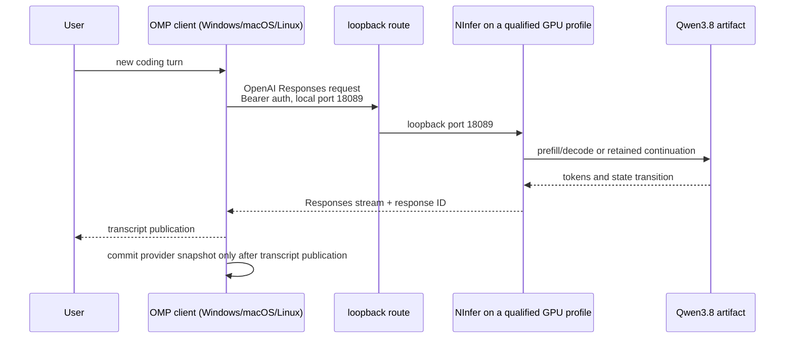

# Architecture

OMP NInfer is an integration and release product, not a third inference runtime. It gives one public
version to an exact OMP client, NInfer runtime, Qwen artifact, hardware profile, connection topology,
and qualification summary.

## v0.2 topology

Both listener endpoints are loopback. In the primary Windows route, Docker Desktop exposes the WSL2
loopback service to native Windows at `127.0.0.1:18089`; in the managed macOS route, an
authenticated SSH local forward carries Mac loopback to remote loopback. The NInfer container uses
Docker host networking on the Linux/WSL2 inference host, so its qualified `--host 127.0.0.1` bind
is host loopback rather than container-private loopback behind an unreachable bridge mapping. SSH
(where used) authenticates the machine path; a separate NInfer bearer token always authenticates
the HTTP endpoint. The NInfer process uses one resident model and one active request in the first
profile. Native Windows 3090/4090 variants retain their own ports, packages, and receipts rather
than inheriting the primary container identity.

The fresh parity candidate keeps that separation while converging restart semantics: the RTX 3090
native package writes authenticated, session-scoped checkpoints under its protected release state,
then restores the prior Responses chain after a managed process replacement. OMP's transcript
remains authoritative if any retained state is absent or invalid.

## State ownership

- **OMP transcript:** authoritative messages, tool calls/results, branches, and session history.
- **OMP provider snapshot:** a private acceleration envelope containing the committed NInfer response
  baseline and identity needed to append the next turn.
- **NInfer Responses state:** process-local retained response/cache state scoped by authenticated
  client and session identity.
- **Qwen artifact:** immutable model bytes pinned by revision, size, and SHA-256.

A turn advances provider state only after a complete valid stream and durable transcript publication.
Cancellation, malformed/incomplete output, transport failure, or transcript persistence failure must
leave the prior committed baseline usable. If acceleration state is absent or invalid, OMP's
transcript remains sufficient for a full replay.

This is why another stateful gateway is not inserted between OMP and NInfer. It would create a second
owner for continuation, persistence, and failure recovery without solving a first-release problem.

## Identity chain

[`manifest.json`](../releases/v0.2.0-beta.1/manifest.json) binds:

1. product release and support channel;
2. OMP public source revision, all three native client artifacts, Homebrew beta cask, sizes, and hashes;
3. primary NInfer source/server/OCI/SBOM plus each native variant package, source archive,
   SBOM/file inventory, configuration, and qualification receipt;
4. Qwen artifact revision, byte count, and hash;
5. canonical runtime configuration hash and hardware profile; and
6. the public product qualification summary and external-install result.

`draft` permits incomplete publication fields and requires explicit blockers. `candidate` requires
every installable component identity and retains the external-install blocker. `ready` additionally
requires an exact qualification-summary hash, an external-install pass, and zero blockers.
`scripts/verify_release.py --require-ready` enforces the cut boundary.

The manifest is authoritative over README examples, Homebrew prose, mutable container tags, and
branch names. Release images are consumed only by `@sha256:` digest.

## Component boundaries

### `omp-ninfer`

Owns product naming, release/profile contracts, setup and support paths, public qualification
composition, and cross-component version pins. It does not own model mathematics, CUDA kernels,
OMP session semantics, or another request proxy.

### OMP

Owns the coding-agent UX, transcript, tools, model configuration, stateful Responses transaction,
and `omp appliance ...` lifecycle. The beta client's exact accepted source is public at
[alphastorm/oh-my-pi](https://github.com/alphastorm/oh-my-pi), carrying the NInfer provider
integration with upstreaming still intended (see [`ROADMAP.md`](../ROADMAP.md)). v0.2 ships both
fail-closed manual configuration and the closed managed appliance adapters.

### NInfer

Owns the `.ninfer` engine/server, CUDA execution, Qwen3.8 runtime, Responses state/cache, authenticated
status, numerical behavior, container/native packages, and runtime qualification. The primary
runtime and reviewed 3090/4090 branches are public under
[alphastorm/ninfer](https://github.com/alphastorm/ninfer), retaining their upstream lineage and
separate hardware contracts.

### Homebrew tap

Owns distribution of the exact native client archives (Windows, macOS, Linux) plus the stable
`omp` and prerelease `omp-beta` casks, kept separate so early access does not silently replace the
stable channel.

## v0.2 cutover

The long-term UX stays under `omp appliance ...`. V0.2 adds a remote appliance platform that
consumes the same manifest, performs state-faithful install/upgrade/rollback, and emits content-safe
receipts while retaining the manual route as a bounded fallback. It does not add a second product
name or another continuation owner.
