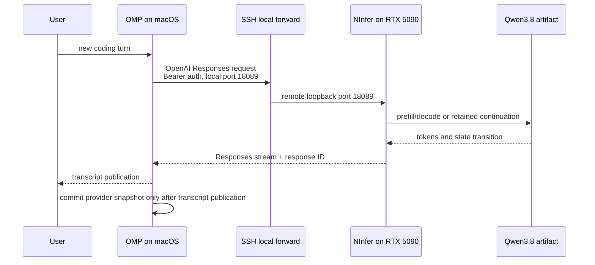

# Architecture

OMP NInfer is an integration and release product, not a third inference runtime. It gives one public
version to an exact OMP client, NInfer runtime, Qwen artifact, hardware profile, connection topology,
and qualification summary.

## v0.1 topology

Both listener endpoints are loopback. The NInfer container uses Docker host networking on the
Linux/WSL2 inference host, so its qualified `--host 127.0.0.1` bind is host loopback rather than
container-private loopback behind an unreachable bridge mapping. SSH authenticates the machine
path; a separate NInfer bearer token authenticates the HTTP endpoint. The NInfer process uses one
resident model and one active request in the first profile.

## State ownership

- **OMP transcript:** authoritative messages, tool calls/results, branches, and session history.
- **OMP provider snapshot:** a private acceleration envelope containing the committed NInfer response
  baseline and identity needed to append the next turn.
- **NInfer Responses state:** process-local retained response/cache state scoped by authenticated
  client and session identity.
- **Qwen artifact:** immutable model bytes pinned by revision, size, and SHA-256.

A turn advances provider state only after a complete valid stream and durable transcript publication.
Cancellation, malformed/incomplete output, transport failure, or transcript persistence failure must
leave the prior committed baseline usable. If acceleration state is absent or invalid, OMP's
transcript remains sufficient for a full replay.

This is why another stateful gateway is not inserted between OMP and NInfer. It would create a second
owner for continuation, persistence, and failure recovery without solving a first-release problem.

## Identity chain

[`manifest.json`](../releases/v0.1.0-beta.1/manifest.json) binds:

1. product release and support channel;
2. OMP upstream/source revision, macOS artifact, Homebrew beta cask, size, and hash;
3. NInfer upstream/source revision, server binary hash, OCI digest, and SBOM;
4. Qwen artifact revision, byte count, and hash;
5. canonical runtime configuration hash and hardware profile; and
6. the public product qualification summary and external-install result.

`draft` permits incomplete publication fields and requires explicit blockers. `candidate` requires
every installable component identity and retains the external-install blocker. `ready` additionally
requires an exact qualification-summary hash, an external-install pass, and zero blockers.
`scripts/verify_release.py --require-ready` enforces the cut boundary.

The manifest is authoritative over README examples, Homebrew prose, mutable container tags, and
branch names. Release images are consumed only by `@sha256:` digest.

## Component boundaries

### `omp-ninfer`

Owns product naming, release/profile contracts, setup and support paths, public qualification
composition, and cross-component version pins. It does not own model mathematics, CUDA kernels,
OMP session semantics, or another request proxy.

### OMP

Owns the coding-agent UX, transcript, tools, model configuration, stateful Responses transaction,
and eventual `omp appliance ...` lifecycle. In v0.1, the custom provider route is configured
manually; source-integrated managed appliance installation remains non-installable.

### NInfer

Owns the `.ninfer` engine/server, CUDA execution, Qwen3.8 runtime, Responses state/cache, authenticated
status, numerical behavior, container, and runtime qualification. The 5090 and 4090 forks remain
separate runtime repositories until their target contracts converge by evidence rather than naming.

### Homebrew tap

Owns installation of the exact macOS OMP bundle. Stable `omp` and prerelease `omp-beta` are separate
casks so early access does not silently replace the stable channel.

## v0.2 cutover

The long-term UX stays under `omp appliance ...`. V0.2 should replace the manually operated SSH
forward and container commands with a remote appliance platform that consumes the same manifest,
performs state-faithful install/upgrade/rollback, and emits content-safe receipts. It must not add a
second product name or duplicate the runtime.
