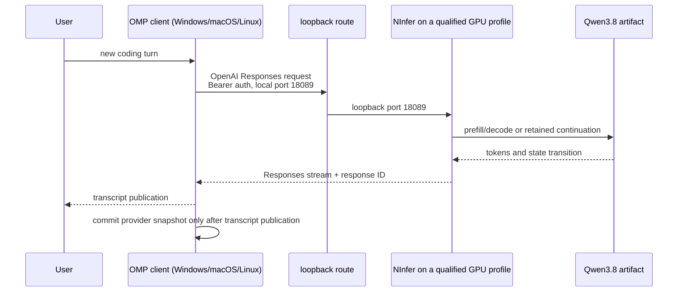

# Architecture

OMP NInfer is an integration and release product, not a third inference runtime. It gives one public
version to an exact OMP client, NInfer runtime, Qwen artifact, hardware profile, connection topology,
and qualification summary.

## Runtime topology

```mermaid
sequenceDiagram
    participant User
    participant OMP as OMP client (Windows/macOS/Linux)
    participant Route as loopback route
    participant NInfer as NInfer on a qualified GPU profile
    participant GPU as Qwen3.8 artifact

    User->>OMP: new coding turn
    OMP->>Route: OpenAI Responses request<br/>Bearer auth, local port 18089
    Route->>NInfer: loopback port 18089
    NInfer->>GPU: prefill/decode or retained continuation
    GPU-->>NInfer: tokens and state transition
    NInfer-->>OMP: Responses stream + response ID
    OMP-->>User: transcript publication
    OMP->>OMP: commit provider snapshot only after transcript publication
```

Both listener endpoints are loopback. In the primary Windows route, Docker Desktop exposes the WSL2
loopback service to native Windows at `127.0.0.1:18089`; in the managed macOS route, an
authenticated SSH local forward carries Mac loopback to remote loopback. The NInfer container uses
Docker host networking on the Linux/WSL2 inference host, so its qualified `--host 127.0.0.1` bind
is host loopback rather than container-private loopback behind an unreachable bridge mapping. SSH
(where used) authenticates the machine path; a separate NInfer bearer token always authenticates
the HTTP endpoint. The NInfer process uses one resident model and one active request in the first
profile. Native Windows 3090/4090 variants retain their own ports, packages, and receipts rather
than inheriting the primary container identity.

All three release lanes write authenticated, session-scoped checkpoints to local storage,
then restore the prior Responses chain after a process restart. OMP's transcript
remains authoritative if any retained state is absent or invalid.

## State ownership

- **OMP transcript:** authoritative messages, tool calls/results, branches, and session history.
- **OMP provider snapshot:** a private acceleration envelope containing the committed NInfer response
  baseline and identity needed to append the next turn.
- **NInfer Responses state:** retained response/cache state scoped by authenticated client and
  session identity, with durable checkpoints for restart recovery on all three lanes.
- **Qwen artifact:** immutable model bytes pinned by revision, size, and SHA-256.

A turn advances provider state only after a complete valid stream and durable transcript publication.
Cancellation, malformed/incomplete output, transport failure, or transcript persistence failure must
leave the prior committed baseline usable. If acceleration state is absent or invalid, OMP's
transcript remains sufficient for a full replay.

This is why another stateful gateway is not inserted between OMP and NInfer. It would create a second
owner for continuation, persistence, and failure recovery without solving a first-release problem.

## Checkpoint transport

`scripts/checkpoint_sync.py` exports verified published generations to replica storage and
imports them into a local checkpoint root before restore. Host-to-host copying and NAS
replication are implemented; the live runtime never serves a network-share checkpoint root.
Sync checks payload hashes; the runtime authenticates `manifest.mac`. Restore requires the
matching runtime binary, model, profile, and bearer-bound session identity. The recorded
recovery probes return state to its original lane, not a second inference host or different GPU.
See [operator guidance and receipts](FACTS.md#checkpoint-transport-and-nas-replication).

## Identity chain

The [published release manifest](../releases/v0.10.0/manifest.json) binds:

1. product release and support channel;
2. upstream OMP source revision, platform binaries, byte counts, and SHA-256 pins;
3. primary NInfer source/server/OCI/SBOM plus each native variant package, source archive,
   SBOM/file inventory, configuration, and qualification receipt;
4. Qwen artifact revision, byte count, and hash;
5. canonical runtime configuration hash and hardware profile; and
6. the public product qualification summary and external-install result.

`draft` permits incomplete publication fields and requires explicit blockers. `candidate` requires
every installable component identity and retains the external-install blocker. `ready` additionally
requires an exact qualification-summary hash, an external-install pass, and zero blockers.
`scripts/verify_release.py --require-ready` enforces the cut boundary.

The manifest is authoritative over README examples, mutable container tags, and
branch names. Release images are consumed only by `@sha256:` digest.

## Component boundaries

### `omp-ninfer`

Owns product naming, release/profile contracts, setup and support paths, public qualification
composition, and cross-component version pins. It does not own model mathematics, CUDA kernels,
OMP session semantics, or another request proxy.

### OMP

Owns the coding-agent UX, transcript, tools, and model configuration. The client is unmodified
[upstream OMP](https://github.com/can1357/oh-my-pi), pinned by SHA-256; the unreleased candidate
uses upstream's per-model `compat.statefulResponses` for Responses chaining. It does not inherit
the published client's qualification. Stock OMP has no `omp appliance` commands.

### NInfer

Owns the `.ninfer` engine/server, CUDA execution, Qwen3.8 runtime, Responses state/cache, authenticated
status, numerical behavior, container/native packages, and runtime qualification. The primary
runtime and reviewed 3090/4090 branches are public under
[alphastorm/ninfer](https://github.com/alphastorm/ninfer), retaining their upstream lineage and
separate hardware contracts.

### Homebrew tap (historical)

The public [alphastorm/oh-my-pi](https://github.com/alphastorm/oh-my-pi) fork and the
`alphastorm/homebrew-omp` tap (private since 2026-10-02) distributed the client through v0.7.4.
They are historical, not the current install path. This product no longer builds or publishes
an OMP client.

## Lifecycle routes

Install, upgrade, stop, and rollback follow the documented container and native Windows routes
in the [quickstart](QUICKSTART.md), not `omp appliance` commands. OMP remains the transcript
and coding-agent UX owner.
