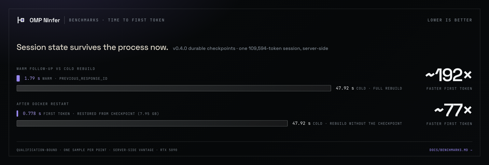
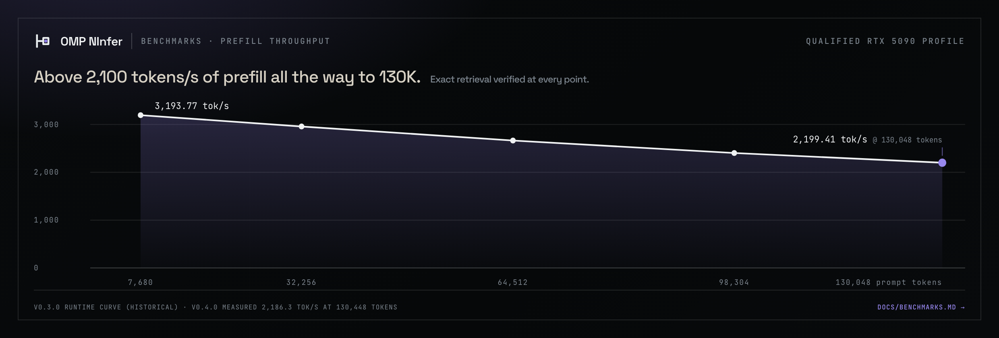
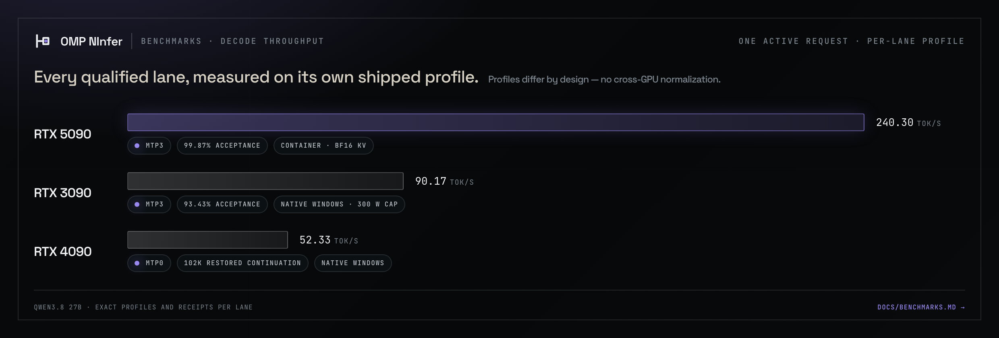

# Benchmarks

Every number on this page is a recorded measurement with a receipt, or it is explicitly labelled as
someone else's published result. Measurements belong to the exact candidate, profile, and machine
that produced them; none is a universal GPU, model, or end-to-end latency claim.

- **Qualified product results** come from the release qualifications bound into
  [`releases/v0.3.0/qualification.json`](../releases/v0.3.0/qualification.json) and the immutable
  prior-release authorities.
- **Engine campaign results** are published upstream by
  [Neroued/ninfer](https://github.com/Neroued/ninfer) and cover different artifacts and settings.
- **Community results** are tester submissions collected below.

## Qualified `v0.3.0` results

The first public release binds three qualified GPU lanes into one manifest. The shape first —
every chart is a rendering of the same receipts as the tables, never a separate measurement:

### RTX 3090 — native Windows, MTP3, C1, 300 W cap

Promoted from the post-release parity campaign: the v0.3.0 manifest binds the exact package
`e7642d7069e85de497731735bde92a0c9b23f5b486848ab8cbe5c4da222baf97` (573,355,399 bytes) at source
`872ee508c1f9c46fa38f4170c7e21f254a79e21f`.

| Gate | Result | Detail |
| --- | ---: | --- |
| Authenticated protocol | **15/15 passed** | OpenAI, Anthropic, Responses, tools, isolation, continuation, delete survival |
| Long context | **64,512 prompt tokens** | exact `ORCHID=493817; COLOR=COBALT` retrieval in 88.89 s |
| Durable restart | **passed** | PID replaced; 45 cached input tokens and 310,216,517 checkpoint bytes restored from disk |
| Managed C1 decode | **90.17 tok/s** | exact 1,024-token completion; 16.48 s end-to-end wall time |
| Managed C1 prefill | **893.41 tok/s** | 4,541 computed prompt tokens; no prefix hit |
| MTP3 acceptance | **93.43%** | exact managed C1 workload |
| Peak envelope | **21,159 MiB · 299.8 W · 47 °C** | GPU-only qualification at the 300 W cap |
| Lifecycle / OMP | **passed** | clean install, upgrade, two rollback directions, protected ACLs, exact read-tool answer |

### RTX 4090 — native Windows, MTP0, C1

Rebound from its qualified component release (`v0.2.0-qwen38-4090-beta.1`); identities unchanged.

| Gate | Result |
| --- | --- |
| Decode | **52.330 tok/s** over 1,168 tokens |
| Prefill | **1,410.691 tok/s** |
| Durable restart | 102,060-token checkpoint seed; 102,075-token restored continuation after process replacement |
| OMP | source-controlled typed-tool Golden-equivalent passed |

### RTX 5090 — container, MTP3, C1

The v0.3.0 lane ships new runtime bytes carrying the io_uring durable-checkpoint backend; its
decode, prefill, exact-context, restart, and protocol gates are bound by the fresh qualification
receipt in [`releases/v0.3.0/qualification.json`](../releases/v0.3.0/qualification.json).

### Durable checkpoints on every lane

v0.3.0 ships checkpoint-backed session durability on all three lanes — DirectStorage on native
Windows, io_uring in the Linux container. A follow-up continues from restored state after a
process restart instead of re-prefilling the transcript, and each lane's restart gate binds the
exact observed restoration above. Upstream,
[UDPSendToFailed/ninfer-4090](https://github.com/UDPSendToFailed/ninfer-4090) measured its
DirectStorage cold restore at 10.1 GB/s (1.51 GiB in 150 ms) on its own artifacts — an
engine-family capability reference, not a product claim.

## Qualified `v0.2.0-beta.1` results

Every row below belongs to one exact package and profile; comparisons across GPUs are descriptive,
not an architecture-normalized benchmark.

### RTX 5090 — BF16 KV, MTP3, C1, 131,072-token context ceiling

| Gate | Result | Detail |
| --- | --- | --- |
| Decode throughput | **235.02 tok/s** | 2,048 completion tokens; 8.71 s decode |
| MTP3 acceptance | **99.87%** | 1,534 of 1,536 drafted tokens accepted on this fixed output workload |
| 7,680-token prefill | **3,268.57 tok/s** | exact retrieval |
| 32,256-token prefill | **3,055.49 tok/s** | exact retrieval |
| 64,512-token prefill | **2,687.17 tok/s** | exact retrieval |
| 98,304-token prefill | **2,394.44 tok/s** | exact retrieval |
| 130,048-token prefill | **2,180.87 tok/s** | exact retrieval; 59.80 s server round trip |
| Agent protocol | **passed** | authenticated OpenAI, Anthropic, Responses, tools, continuation, forks, delete survival |

### Native Windows runtime variants

| GPU/profile | Context gate | Process restart | Decode | Prefill | Peak VRAM | OMP gate |
| --- | --- | --- | ---: | ---: | ---: | --- |
| RTX 3090 released v0.2 preview | released live gate `not_run` | released restart gate `not_run` | no released-package claim | no released-package claim | no released-package claim | historical preview remains non-installable |
| RTX 4090, `qwen38-4090-v0.1`, MTP0, C1 | 102,060-token checkpoint seed and 102,075-token restored continuation | process replacement and disk restore passed | **52.330 tok/s** over 1,168 tokens | **1,410.691 tok/s** | profile-bound | source-controlled typed-tool Golden-equivalent passed |

### RTX 3090 parity campaign (2026-08-30)

The RTX 3090 lane was qualified after the v0.2 cut as candidate package
`e7642d7069e85de497731735bde92a0c9b23f5b486848ab8cbe5c4da222baf97` at source
`872ee508c1f9c46fa38f4170c7e21f254a79e21f`; `v0.3.0` binds those exact bytes, and the full gate
table above is this campaign's receipt promoted into the release. Hash-bound candidate receipt:
[2026-08-30-rtx3090-parity.json](measurements/2026-08-30-rtx3090-parity.json). The separate,
stricter unattended evidence-role corpus did not pass, so that automatic route stays disabled.

## Maintainer measurement — warm vs cold follow-up turn (2026-08-29)

The first entry from the [planned-measurements list](#benchmarks-we-still-want), measured
post-release on the released RTX 5090 runtime bytes (the image digest, server binary, and model of
`qwen38-5090-v0.2.0-beta.2`). This is a labeled maintainer measurement with a committed receipt
([`measurements/2026-08-29-warm-vs-cold-ttft.json`](measurements/2026-08-29-warm-vs-cold-ttft.json)),
not a qualification-bound product claim.

| Session (input tokens) | Warm follow-up TTFT (`previous_response_id`) | Cold equivalent TTFT (forced full prefill) | Ratio |
| ---: | ---: | ---: | ---: |
| 28,558 | **0.208 s** (28,553 tokens served from retained state) | 9.407 s | ~45× |
| 89,216 | **0.375 s** (89,211 tokens served from retained state) | 36.697 s | ~98× |

Method: server-side loopback vantage on the runtime host; TTFT is the time to the first streamed
generated token; the cold pair sends a fresh equivalent-length synthetic prompt that cannot reuse
any prefix; one sample per point. The server's own `usage.input_tokens_details.cached_tokens`
attests the retained-state reuse, and the cold time-to-first-token is consistent with the
qualified prefill curve above.

## Qualified `v0.1.0-beta.1` results

Measured on one NVIDIA GeForce RTX 5090 (`sm_120a`) with the exact shipped profile:
`qwen3_8_27b.ninfer` (Qwen3.8 27B, groupwise-int Q4/Q5 group-64), BF16 KV cache, 131,072-token
context ceiling, MTP speculative decoding with 3 draft tokens, 1,024-token prefill chunks, one
active request. Receipts: [`qualification.json`](../releases/v0.1.0-beta.1/qualification.json) ·
[v0.1 manifest](../releases/v0.1.0-beta.1/manifest.json).

| Gate | Result | Detail |
| --- | --- | --- |
| Decode throughput | **209.04 tok/s** | 1,143 completion tokens in 5.47 s decode; release gate ≥ 200.6 |
| MTP3 acceptance | **77.0%** | 799 of 1,038 drafted tokens accepted |
| Long context | **130,048-token prompt, exact retrieval** | full round trip in 58.5 s, 17 completion tokens |
| Stateful reuse | **37,591-token prefix-cache hit** | zero recomputation on the largest observed warm request |
| Session semantics | continuation, 2 forks, delete survival | cache reuse observed across the stateful Responses lifecycle |
| Golden t01 | **exact match in 100.2 s** | fixed end-to-end OMP agent task (runner OMP 18.0.5), bound 120.9 s |
| Serving contract | OpenAI, Anthropic, Responses, Vision | plus authenticated status identity |

During the v0.1.0-beta.1 stateful-responses qualification, 18 of 31 telemetry requests were served
from retained state rather than recomputed prefill.

### What those numbers mean in a coding session

- **209 tok/s decode with thinking preserved.** Agent turns are decode-heavy; drafted-and-verified
  MTP3 commits multiple tokens per backbone pass instead of one.
- **130K context is real, not nominal.** The gate is an exact-output retrieval across a
  130,048-token prompt, not a perplexity curve.
- **Warm turns skip the re-read.** OMP appends to retained GPU state through stateful OpenAI
  Responses (`previous_response_id`). In that v0.1 campaign, the 37,591-token prefix hit is a whole
  session prefix the GPU did not re-prefill. A stateless provider route would recompute that prefix
  on every turn.
- **Correctness does not depend on the cache.** OMP commits its transcript before advancing
  provider state; retained GPU state is an acceleration that can be discarded and replayed.

## Model quality at this quantization

Published by [Neroued/ninfer](https://github.com/Neroued/ninfer#evaluation) for the registered
artifacts (EvalScope 1.9.0, 0-shot, one sample per problem, thinking enabled, MTP3). The shipped
product artifact is the `groupwise-int` row:

| Artifact profile | AIME 2025 | AIME 2026 | GPQA-Diamond | ERQA | RealWorldQA |
| --- | ---: | ---: | ---: | ---: | ---: |
| Qwen3.8-27B `groupwise-int` (shipped) | 96.67% | 96.67% | 87.37% | 66.25% | 82.22% |
| Qwen3.8-27B `nvfp4` | 96.67% | 96.67% | 90.40% | 66.25% | 83.53% |

These are single-sample runs on small question sets (30 and 198 items) under one evaluation
profile: a strong sanity signal that the quantization preserves capability, not a leaderboard
claim.

## Engine campaign highlights

The NInfer engine's published performance campaign — measured and documented upstream by
[Neroued/ninfer](https://github.com/Neroued/ninfer#performance) on one RTX 5090 with INT8 KV and
different artifacts/settings than the shipped product profile:

| Published upstream measurement | Result |
| --- | --- |
| Qwen3.6-35B-A3B prefill at a 7,680-token prompt | 15,544 tok/s |
| Qwen3.6-27B `nvfp4` prefill at a 7,680-token prompt | 11,191 tok/s (3.48× groupwise-int) |
| Qwen3.6-35B-A3B saturated decode at concurrency 8 | 1,313.8 aggregate tok/s |
| Qwen3.6-27B `nvfp4` saturated decode at concurrency 8 | 1,146.9 aggregate tok/s (5.67× C=1) |
| Qwen3.8-27B `nvfp4` MTP3 structured output | 219.8 tok/s at 90.8% acceptance |

Those results are not product claims: the shipped v0.1 profile is Qwen3.8-27B `groupwise-int` with
BF16 KV and one active request, and its qualified numbers are the table at the top. They show the
headroom of the engine family this product rides on. Full methodology:
[upstream performance document](https://github.com/Neroued/ninfer/blob/master/docs/performance.md).

## Community results

Community leaderboard. One row per verified environment; newest first. Submit yours with the
[performance result form](https://github.com/alphastorm/omp-ninfer/issues/new?template=benchmark-report.yml)
after the documented acceptance checks pass.

| Date | GPU | VRAM | Topology | Release | Decode tok/s | MTP accept | Long-context check | Source |
| --- | --- | --- | --- | --- | ---: | ---: | --- | --- |
| 2026-08 | RTX 5090 | 32 GiB | Windows 11 + Docker Desktop WSL2 | v0.2.0-beta.1 | 235.02 | 99.87% | 130,048 tokens, exact | [qualification](../releases/v0.2.0-beta.1/qualification.json) (maintainer) |
| 2026-08 | RTX 4090 | 24 GiB | Native Windows 11 x64 | v0.2.0-beta.1 | 52.330 | — (MTP0 profile) | 102,075-token restored continuation after process restart | [qualification](../releases/v0.2.0-beta.1/qualification/rtx4090.json) (maintainer) |
| 2026-08 | RTX 3090 | 24 GiB | Native Windows 11 x64 | v0.3.0 | 90.17 | 93.43% | 64,512 tokens, exact | [qualification](../releases/v0.3.0/qualification.json) (maintainer) |

Submission rules:

1. Run the exact ready release (`python3 scripts/verify_release.py --require-ready` passes) on the
   documented topology.
2. Report only content-safe values: hardware, driver, versions, throughput, acceptance, and check
   results. No prompts, outputs, hostnames, or raw logs.
3. State the measurement method. Server-side measurements come from the component harnesses; the
   managed appliance profile also exposes `benchmark --quick` for its exact published runtime.
4. Rows are added after a maintainer matches the report against the release identities.

## Benchmarks we still want

Planned measurements that would sharpen the picture; contributions welcome
(see [`PERFORMANCE.md`](PERFORMANCE.md)):

- **Warm vs cold turn latency sweep** on the product profile: the first 28K/89K pair is measured
  above; the fuller sweep — 10K/37K/100K-token sessions with repetitions and client-side vantage —
  remains open.
- **End-to-end OMP turn latency distribution** on Golden-class agent tasks, client-measured.
- **Matched MTP0/MTP3 ablation** on one unchanged artifact and context profile.
- **Concurrency curves** for future 3090/4090 profiles only after exact memory-admission gates are
  defined.

Publishing rule: a new number enters this page only with its receipt, exact profile, and machine
identity, and product claims change only through a new qualification binding
(see [`RELEASES.md`](RELEASES.md)).
